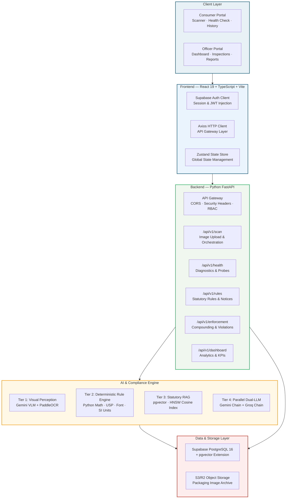
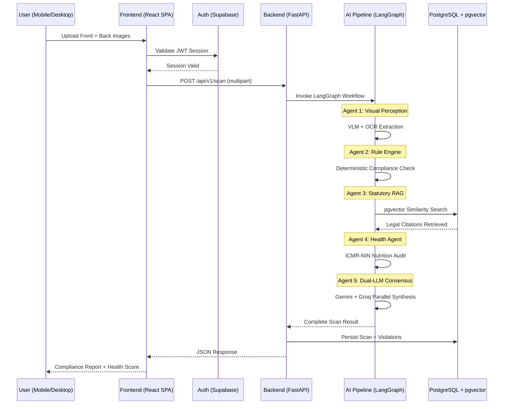
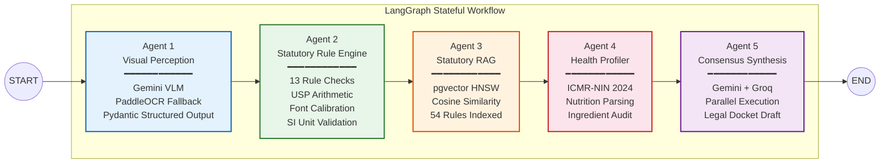
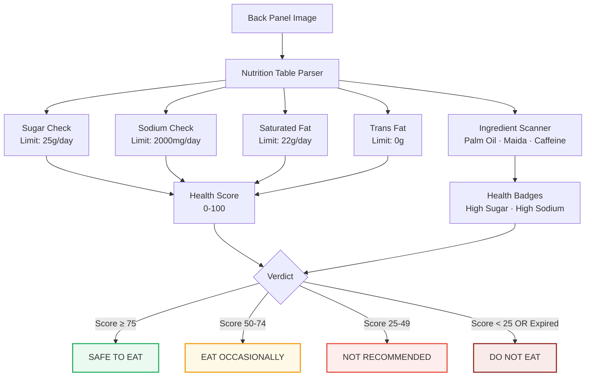
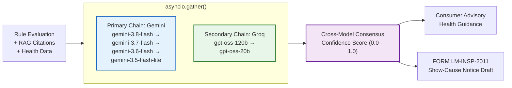
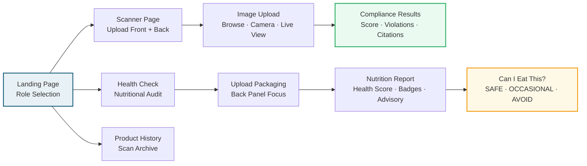
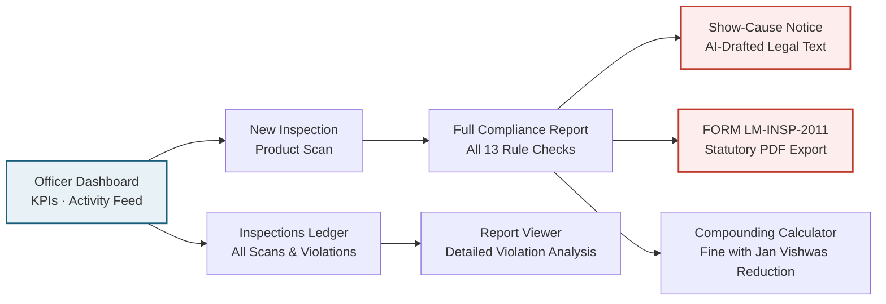

<div align="center">

# PackDrashiti

### Automated Compliance Verification of Packaged Commodities under Legal Metrology Rules, 2011

**Problem Statement ID**: SIH26034  
**Ministry**: Ministry of Consumer Affairs, Food & Public Distribution — Legal Metrology Division, Government of India

---

*Scan a product. Detect violations. Protect consumers. All in under 8 seconds.*

</div>

---

## Table of Contents

- [The Problem](#the-problem)
- [Our Solution](#our-solution)
- [Key Features](#key-features)
- [System Architecture](#system-architecture)
- [AI Pipeline — 5-Agent LangGraph Workflow](#ai-pipeline--5-agent-langgraph-workflow)
- [Statutory Rules Engine](#statutory-rules-engine)
- [Nutritional Health Engine (ICMR-NIN 2024)](#nutritional-health-engine-icmr-nin-2024)
- [Technology Stack](#technology-stack)
- [Application Screenshots & User Flows](#application-screenshots--user-flows)
- [Repository Structure](#repository-structure)
- [Getting Started](#getting-started)
- [API Reference](#api-reference)
- [Testing & Quality Assurance](#testing--quality-assurance)
- [Deployment](#deployment)
- [Team](#team)
- [References & Legal Authority](#references--legal-authority)

---

## The Problem

In India, **every retail pre-packaged commodity** is governed by the **Legal Metrology Act, 2009** and the **Legal Metrology (Packaged Commodities) Rules, 2011**. The law mandates **13+ mandatory declarations** on every package — manufacturer identity, net quantity in SI units, MRP inclusive of all taxes, Unit Sale Price, country of origin, consumer care details, and more.

### Current Reality

| Challenge | Impact |
|:---|:---|
| **Manual Inspections** | A single inspector covers 500+ SKUs per market visit — physically reading every label is infeasible |
| **Illegal Unit Abbreviations** | Packages print `gms`, `Kgs`, `ltrs` instead of legal `g`, `kg`, `l` — consumers never notice |
| **Price Manipulation** | Dual MRP stickers, missing Unit Sale Price, and hidden "inclusive of all taxes" clauses |
| **Font Size Violations** | Mandatory declarations printed in illegibly small fonts violating Rule 7 Table-I |
| **No Consumer Tool** | Zero automated tools exist for consumers to verify label compliance or nutritional safety |
| **Nutritional Deception** | Misleading "healthy" branding on products with dangerously high sugar, sodium, or trans fats |

> **Result**: Millions of non-compliant packages reach consumers daily, enabling unfair trade practices, health risks, and regulatory evasion worth an estimated **Rs 10,000+ crore annually**.

---

## Our Solution

**PackDrashiti** is an AI-powered regulatory compliance verification and nutritional auditing platform. A user simply **photographs a product's front and back label** — the system automatically extracts all declarations, validates them against statutory rules, computes a compliance score, and generates enforceable inspection dockets.

```
                   ┌─────────────────┐
                   │   Scan Product   │
                   │  (Front + Back)  │
                   └────────┬────────┘
                            │
                   ┌────────▼────────┐
                   │  AI Perception  │  Multimodal VLM + PaddleOCR
                   │  Agent (Tier 1) │  Structured Data Extraction
                   └────────┬────────┘
                            │
              ┌─────────────┼─────────────┐
              │             │             │
     ┌────────▼──────┐ ┌───▼──────┐ ┌────▼────────┐
     │  Rule Engine   │ │ RAG Agent│ │   Health    │
     │  (Tier 2)      │ │ (Tier 3) │ │   Engine    │
     │  Deterministic │ │ pgvector │ │  ICMR-NIN   │
     └────────┬──────┘ └───┬──────┘ └────┬────────┘
              │             │             │
              └─────────────┼─────────────┘
                            │
                   ┌────────▼────────┐
                   │  Dual-LLM       │  Gemini + Groq Parallel
                   │  Consensus      │  Synthesis (Tier 4)
                   │  (Tier 4)       │
                   └────────┬────────┘
                            │
              ┌─────────────┼─────────────┐
              │                           │
     ┌────────▼──────────┐   ┌────────────▼───────────┐
     │  Consumer Report  │   │  FORM LM-INSP-2011     │
     │  Health Score     │   │  Statutory Notice PDF   │
     │  Dietary Advisory │   │  Violation Docket       │
     └───────────────────┘   └────────────────────────┘
```

### Two Distinct Modes

| Mode | User | Capabilities |
|:---|:---|:---|
| **Consumer Mode** | Everyday shoppers | Scan labels, verify MRP fairness, check Unit Sale Price, get Health Score, dietary advisory, ingredient audit |
| **Officer Mode** | Legal Metrology Inspectors | All consumer features + Font height verification (Rule 7 Table-I), color contrast analysis (Rule 9 WCAG), violation dockets, FORM LM-INSP-2011 PDF generation, compounding calculator, enforcement dashboard |

---

## Key Features

### For Consumers

- **Instant Label Scan** — Photograph front + back panels; get complete compliance results in <8 seconds
- **MRP & Unit Sale Price Verification** — Validates "inclusive of all taxes" clause and computes fair USP per gram/ml
- **Health Score (0-100)** — ICMR-NIN 2024 nutritional benchmarking with immediate bodily impact warnings
- **3-Tier Color Additive Grading** — Grade A (natural), Grade B (permitted synthetic), Grade C (high-concern azo dyes)
- **"Can I Eat This?" Verdict** — Definitive SAFE / EAT OCCASIONALLY / NOT RECOMMENDED / DO NOT EAT banner
- **Ingredient Science Guide** — Plain-language explanations of what ingredients do to the human body
- **Product History** — Searchable archive of all previously scanned products
- **PWA + Mobile Camera** — Install as native app; direct hardware camera capture with autofocus and flash

### For Enforcement Officers

- **Rule 7 Font Height Calibration** — Automatic PDP area calculation and Table-I minimum height verification
- **Rule 9 Color Contrast Analysis** — WCAG 2.1 contrast ratio computation (minimum 3.0:1 threshold)
- **Statutory Violation Flagging** — Auto-detects 13+ violation categories with Section 36(1) penalty citations
- **FORM LM-INSP-2011 PDF** — One-click generation of official statutory inspection dockets with photographic evidence
- **Compounding Calculator** — Automatic fine computation under Section 48 with Jan Vishwas 20% reduction
- **Enforcement Dashboard** — Real-time KPIs, district activity ledger, inspection timeline, compliance trends
- **Show-Cause Notice Drafting** — AI-generated formal legal notices with RAG-backed statutory citations

---

## System Architecture

### High-Level Architecture



### Request Lifecycle



---

## AI Pipeline — 5-Agent LangGraph Workflow

The core intelligence of PackDrashiti is a **stateful 5-agent LangGraph workflow** that processes packaging images through a sequential multi-agent pipeline. Each agent is a specialized node in the graph.

### Pipeline Architecture



### Agent Details

#### Agent 1 — Visual Perception (Tier 1)

Multimodal VLM agent that directly inspects front and back packaging panel images. Uses **Google Gemini** for spatial perception with **PaddleOCR** as zero-manual-step fallback.

**Extracts**: Product name, brand, manufacturer address, net quantity, MRP, USP, manufacturing date, expiry date, FSSAI license, barcode, country of origin, consumer care info, nutritional table, ingredient list, PDP dimensions.

**Output**: Pydantic-validated `PackageVisualExtraction` schema with all 13+ mandatory declaration fields.

#### Agent 2 — Deterministic Rule Engine (Tier 2)

100% mathematically auditable Python logic for statutory compliance. **No AI hallucination possible** — every check is deterministic.

| Check | Rule | Logic |
|:---|:---|:---|
| Manufacturer/Packer Address | Rule 6(1)(a) | Regex: `(Manufactured\|Packed\|Marketed\|Imported)` + PIN `\b[1-9][0-9]{5}\b` |
| Country of Origin | Rule 6(1)(aa) | Match against ISO 3166-1 country list |
| Generic Commodity Name | Rule 6(1)(b) | Non-empty commodity descriptor verification |
| Net Quantity SI Units | Rule 6(1)(c) & Rule 13 | Strict whitelist: `g`, `kg`, `ml`, `l`. Flags: `gms`, `Kgs`, `ltrs`, `oz` |
| Date of Manufacture | Rule 6(1)(d) | Format validation: `MM/YYYY`, `MM/YY`, `Month Year` |
| MRP Declaration | Rule 6(1)(e) | "inclusive of all taxes" clause detection |
| Unit Sale Price (USP) | Rule 6(1)(e) 2nd Proviso | Mathematical computation: `MRP / net_quantity` in per g/ml or per kg/L |
| Consumer Care Contacts | Rule 6(1)(n) | 4 elements: contact person, address, phone, email |
| Font Height | Rule 7 Table-I | PDP area → minimum mm height step function (1.0 to 6.0 mm) |
| Color Contrast | Rule 9(1) | WCAG 2.1 relative luminance ratio ≥ 3.0:1 |
| Dual MRP Detection | Rule 18(2A) | Multiple price sticker / alteration detection |

**Rule 7 Table-I — Font Height Calibration**:

| PDP Area (cm²) | Minimum Height (mm) |
|:---|:---|
| ≤ 50 | 1.0 |
| 51–100 | 1.5 |
| 101–500 | 2.0 |
| 501–2500 | 4.0 |
| > 2500 | 6.0 |

#### Agent 3 — Statutory RAG (Tier 3)

Retrieval-Augmented Generation over the complete **Legal Metrology (Packaged Commodities) Rules, 2011** codified into a searchable vector database.

- **Vector Store**: Supabase PostgreSQL 16 with native `pgvector` extension
- **Index**: HNSW cosine similarity index over 54 rule embeddings
- **Dataset**: 878 statutory rule entries in `cleaned_rules_2011_2026.json` covering all chapters, amendments, and penalty provisions
- **Retrieval**: Semantic search matching detected violations to exact statutory clauses, penalty amounts, and compounding provisions

#### Agent 4 — Consumer Health Profiler (Tier 4a)

Nutritional safety audit engine benchmarked against **ICMR-NIN Recommended Dietary Allowances, 2024** and **WHO/FSSAI** thresholds.



**Checks performed**:
- Excess sugar, sodium, saturated fat, trans fat per 100g vs ICMR-NIN safe limits
- Artificial color additive grading (Grade A/B/C based on E-number classification)
- Ingredient hazard scanning (Palm Oil, Maida, Added Sugar, Caffeine, UPF markers)
- Immediate bodily reaction documentation (0-2 hours post-consumption)
- Chronic clinical risk mapping (NAFLD, atherosclerosis, hypertension, T2DM)

#### Agent 5 — Parallel Dual-LLM Consensus Synthesis (Tier 4b)

Final synthesis layer that fuses statutory findings, RAG citations, and health data into human-readable reports using **two independent LLM chains running concurrently**.



- **Fault Tolerance**: Each chain has a fallback hierarchy — if `gemini-3.8-flash` is unavailable, it cascades to `3.7`, `3.6`, `3.5-lite`
- **Latency Optimization**: Both chains run concurrently via `asyncio.gather()`, so total latency = `max(gemini_time, groq_time)` rather than `sum()`
- **Cross-Validation**: Consensus confidence score reflects agreement between two independent model families

---

## Statutory Rules Engine

### Complete Compliance Verification Matrix

PackDrashiti validates against **13 statutory rules** from the Legal Metrology (Packaged Commodities) Rules, 2011:

```mermaid
mindmap
  root((Legal Metrology<br/>Rules 2011))
    Rule 6 — Mandatory Declarations
      6(1)(a) Manufacturer Address + PIN
      6(1)(aa) Country of Origin
      6(1)(b) Generic Commodity Name
      6(1)(c) Net Quantity (SI Units)
      6(1)(d) Date of Manufacture
      6(1)(e) MRP + Tax Clause
      6(1)(e) Unit Sale Price
      6(1)(n) Consumer Care Contacts
    Rule 7 — Font Height
      Table-I PDP Area Calibration
      1.0mm to 6.0mm Scale
    Rule 9 — Conspicuousness
      Color Contrast ≥ 3.0:1
      WCAG 2.1 Luminance Ratio
    Rule 13 — Standard Units
      SI Metric Only
      Prohibited: gms, Kgs, ltrs, oz
    Rule 18 — Price Integrity
      18(2A) Dual MRP Ban
      Sticker Alteration Detection
    Section 36(1) — Penalties
      First Offence: ₹25,000
      Second Offence: ₹50,000
      Subsequent: Imprisonment
```

### Violation Severity Classification

| Severity | Description | Examples | Penalty Range |
|:---|:---|:---|:---|
| **Critical** | Fundamental statutory omission | Missing MRP, missing manufacturer, no net quantity | ₹15,000 – ₹25,000 |
| **Major** | Non-standard declaration format | Illegal units (`gms`), missing USP, font too small | ₹5,000 – ₹15,000 |
| **Minor** | Incomplete but partially compliant | Address without PIN, date format ambiguous | ₹2,000 – ₹10,000 |

### USP (Unit Sale Price) Computation

The system performs **deterministic mathematical computation** of Unit Sale Price as mandated since October 2022:

```
If net_quantity ≤ 1 kg (or 1 L):
    USP = MRP / net_quantity_in_grams    → expressed as ₹X.XX per gram (or per ml)

If net_quantity > 1 kg (or 1 L):
    USP = MRP / net_quantity_in_kg       → expressed as ₹X.XX per kg (or per litre)
```

**Example**: A 250g biscuit packet with MRP ₹40 → USP = ₹40 / 250 = **₹0.16 per gram**

---

## Nutritional Health Engine (ICMR-NIN 2024)

### Benchmarks Used

| Nutrient | ICMR-NIN 2024 Safe Daily Limit | "High" Threshold (per 100g) |
|:---|:---|:---|
| Total Sugar | 25g free sugar/day | > 12.5g per 100g |
| Sodium | 2000mg/day | > 600mg per 100g |
| Saturated Fat | 22g/day (10% of 2000 kcal) | > 5g per 100g |
| Trans Fat | 0g (WHO elimination target) | > 0.5g per 100g |
| Total Fat | 67g/day | > 17.5g per 100g |

### 3-Tier Color Additive Grading

| Grade | Classification | Examples | Advisory |
|:---|:---|:---|:---|
| **Grade A** | Wholesome Natural | Curcumin (100), Beetroot Red (162), Paprika (160c), Chlorophyll (140) | Safe for all ages |
| **Grade B** | Permitted Synthetic | Caramel IV (150d), Brilliant Blue (133) | Within FSSAI limits |
| **Grade C** | High-Concern Azo Dyes | Tartrazine (102), Sunset Yellow (110), Allura Red (129), Titanium Dioxide (171) | EU hyperactivity warning; avoid for children |

### Health Score Algorithm

```
Health Score = 100 - Σ(penalty_per_excess_nutrient) - Σ(ingredient_hazard_penalty)

Penalties applied for:
  - Sugar exceeding ICMR limit:     -15 to -30 points
  - Sodium exceeding limit:         -10 to -25 points
  - Saturated fat exceeding limit:  -10 to -20 points
  - Trans fat detected (any):       -20 to -30 points
  - Palm oil / Maida detected:      -5 to -10 points
  - Grade C color additives:        -5 to -15 points
  - Product expired:                Score = 0 (DO NOT EAT)
```

---

## Technology Stack

### Frontend

| Technology | Version | Purpose |
|:---|:---|:---|
| **React** | 19.2.8 | Component UI framework with concurrent features |
| **TypeScript** | 6.0.2 | Static type safety across entire frontend |
| **Vite** | 8.2.2 | Build toolchain — sub-second HMR, optimized production bundles |
| **Tailwind CSS** | 3.4.19 | Utility-first styling with civic color palette |
| **Zustand** | 5.0.15 | Lightweight global state management |
| **Supabase JS** | 2.116.0 | Auth client — session persistence, JWT token injection |
| **Axios** | 1.20.0 | HTTP client for API communication |
| **Phosphor Icons** | 2.1.10 | Consistent iconography (zero emojis policy) |
| **Oxlint** | 1.79.0 | Blazing-fast linting (Rust-based) |

### Backend

| Technology | Version | Purpose |
|:---|:---|:---|
| **Python** | 3.11+ | Core runtime |
| **FastAPI** | 0.115+ | Async ASGI web framework with automatic OpenAPI docs |
| **Uvicorn** | 0.30+ | High-performance ASGI server |
| **Pydantic** | 2.8+ | Data validation, settings management, schema contracts |
| **SQLAlchemy** | 2.0+ | ORM with async PostgreSQL support |
| **Alembic** | 1.13+ | Database schema migrations |
| **Supabase** | 2.7+ | PostgreSQL + Auth + pgvector + Storage |
| **ReportLab** | 4.2+ | Statutory PDF generation (FORM LM-INSP-2011) |
| **python-jose** | 3.3+ | JWT token verification and RBAC |

### AI & ML

| Technology | Purpose |
|:---|:---|
| **LangGraph** | Stateful multi-agent workflow orchestration |
| **LangChain** | LLM integration framework |
| **Google Gemini** | Primary multimodal VLM (vision + language) |
| **Groq API** | Secondary LLM chain for parallel consensus |
| **PaddleOCR** | Zero-config local OCR fallback |
| **Supabase pgvector** | Vector similarity search for statutory RAG |

### Infrastructure

| Technology | Purpose |
|:---|:---|
| **Supabase** | PostgreSQL 16 database, Auth, pgvector, object storage |
| **Vercel** | Frontend deployment (React SPA) |
| **Render** | Backend deployment (FastAPI + AI pipeline) |

---

## Application Screenshots & User Flows

### Consumer Journey



### Officer Journey



### Key Pages

| Page | Route | Description |
|:---|:---|:---|
| **Landing Page** | `/` | Role selection (Consumer / Officer), feature highlights, PWA install prompt |
| **Scanner Page** | `/scan` | Dual-panel image upload (Browse, Camera, Live View), real-time compliance analysis |
| **Health Check** | `/health` | Back-panel nutrition audit, Health Score, dietary advisory, ingredient science |
| **Product History** | `/history` | Searchable archive of all past scans with compliance scores |
| **Officer Dashboard** | `/officer` | Real-time KPIs, compliance trends, recent activity feed, district statistics |
| **Inspections Ledger** | `/officer/inspections` | Complete inspection history, violation filtering, bulk export |
| **Report Viewer** | `/officer/report/:id` | Detailed violation analysis, statutory citations, PDF generation |

---

## Repository Structure

```
PackDrashiti/
├── frontend/                          # React 19 SPA (Deployed on Vercel)
│   ├── src/
│   │   ├── App.tsx                    # Root router with role-based navigation
│   │   ├── main.tsx                   # Entry point + Service Worker registration
│   │   ├── pages/
│   │   │   ├── consumer/
│   │   │   │   ├── LandingPage.tsx    # Home page with role selection
│   │   │   │   ├── ScannerPage.tsx    # Dual-panel compliance scanner
│   │   │   │   ├── HealthCheckPage.tsx # Nutritional safety audit
│   │   │   │   └── ProductHistoryPage.tsx # Scan archive
│   │   │   └── officer/
│   │   │       ├── OfficerDashboardPage.tsx # Enforcement KPI dashboard
│   │   │       ├── InspectionsPage.tsx # Inspections ledger
│   │   │       └── ReportViewerPage.tsx # Detailed violation report
│   │   ├── components/
│   │   │   ├── common/                # AuthModal, Button, Card, Modal, PWAInstallPrompt
│   │   │   ├── dashboard/            # StatCard, ComplianceChart, ActivityFeed
│   │   │   ├── health/               # HealthBadgeGroup, NutrientRow, ArtificialColorsAudit,
│   │   │   │                         # WhatIsHighCard, DietaryAdvisory
│   │   │   ├── layout/               # Navbar, Footer
│   │   │   ├── officer/              # CompoundingCalculator, NoticePreviewModal
│   │   │   ├── reports/              # ComplianceCard, ViolationCard, ReportHeader
│   │   │   └── scanner/              # AnnotatedImage, Camera
│   │   ├── data/                      # Statutory rules, ICMR benchmarks, mock datasets
│   │   ├── store/                     # Zustand global state stores
│   │   ├── types/                     # TypeScript domain interfaces
│   │   └── utils/                     # Compliance scoring, formatting utilities
│   ├── public/
│   │   ├── manifest.webmanifest       # PWA manifest (icons, shortcuts)
│   │   └── sw.js                      # Service Worker (cache-first + network-first)
│   ├── package.json
│   ├── tailwind.config.js             # Civic teal color palette
│   ├── vercel.json                    # Vercel SPA rewrite + security headers
│   └── vite.config.ts
│
├── backend/                           # Python FastAPI (Deployed on Render)
│   ├── src/
│   │   ├── main.py                    # FastAPI app factory + CORS + security middleware
│   │   ├── api/v1/
│   │   │   ├── router.py             # API v1 route aggregator
│   │   │   └── endpoints/
│   │   │       ├── health.py          # System diagnostics & probes
│   │   │       ├── scan.py            # Image upload & AI pipeline orchestration
│   │   │       ├── rules.py           # Statutory rules & enforcement notices
│   │   │       ├── enforcement.py     # Compounding & violation management
│   │   │       └── dashboard.py       # Analytics & KPI endpoints
│   │   ├── core/
│   │   │   ├── config.py             # Pydantic settings (env vars, LLM chains)
│   │   │   ├── database.py           # SQLAlchemy async engine + session
│   │   │   ├── security.py           # JWT verification + RBAC middleware
│   │   │   └── cache.py              # In-memory async cache (cachetools)
│   │   ├── models/                    # SQLAlchemy 2.0 ORM models
│   │   │   ├── user.py, scan.py      # Users, scans, violations
│   │   │   ├── violation.py          # Statutory violation records
│   │   │   ├── health.py, report.py  # Health data, inspection reports
│   │   │   └── knowledge.py          # RAG knowledge base entries
│   │   └── services/
│   │       ├── health_engine.py       # ICMR-NIN nutrition scoring
│   │       ├── compounding_engine.py  # Section 48 fine calculator
│   │       └── pdf_generator.py       # ReportLab FORM LM-INSP-2011
│   ├── tests/                         # Pytest automated test suite (47 tests)
│   │   ├── test_api.py               # REST API integration tests (9 tests)
│   │   ├── test_enforcement.py       # Violation & compounding tests (9 tests)
│   │   ├── test_health.py            # Nutrition engine tests (4 tests)
│   │   ├── test_scan.py              # Scan pipeline tests (5 tests)
│   │   ├── test_scoring.py           # Compliance scoring tests (8 tests)
│   │   ├── test_security.py          # Auth & RBAC tests (7 tests)
│   │   └── test_db.py               # Database model tests (5 tests)
│   ├── alembic/                       # Database migrations
│   ├── requirements.txt
│   └── Dockerfile
│
├── ai/                                # AI & ML Pipeline
│   └── src/
│       ├── pipeline/
│       │   ├── langgraph_workflow.py  # 5-agent LangGraph state machine
│       │   ├── extractor.py           # VLM + OCR structured extraction
│       │   └── health_agent.py        # Multimodal health analysis agent
│       ├── llm/
│       │   └── dual_engine.py         # Parallel Gemini + Groq fallback engine
│       ├── rag/
│       │   └── supabase_vector.py     # pgvector semantic search module
│       └── rules/
│           ├── deterministic.py       # Deterministic compliance rule engine
│           └── nutrition_parser.py    # Nutritional table parser
│
├── dataset/                           # Legal Metrology Statutory Dataset
│   ├── cleaned_rules_2011_2026.json  # 878 codified rule entries
│   ├── cleaned_rules_2011_2026.csv   # Tabular statutory reference
│   ├── LEGAL_METROLOGY_RULES_2026.md # Digitized gazette codification
│   └── *.pdf                          # Original gazette documents
│
├── docs/                              # Detailed System Documentation (15 docs)
│   ├── prd_master_blueprint.md        # Master PRD & architecture
│   ├── api_specification.md           # Full OpenAPI contract
│   ├── database_schema.md            # PostgreSQL DDL & migrations
│   ├── rules_engine_spec.md          # Complete rules engine specification
│   ├── nutrition_profiling_spec.md   # ICMR-NIN health engine spec
│   ├── security_and_auth.md          # JWT RBAC & evidence chain
│   ├── design_system.md             # Visual design tokens & typography
│   └── ...                           # + 8 more specification documents
│
├── docker-compose.yml                # Local development stack
└── render.yaml                       # Render deployment configuration
```

---

## Getting Started

### Prerequisites

| Requirement | Minimum Version |
|:---|:---|
| Node.js | 18.0.0+ |
| npm | 9.0.0+ |
| Python | 3.11+ |
| pip | 23.0+ |

### 1. Clone the Repository

```bash
git clone https://github.com/<your-org>/PackDrashiti.git
cd PackDrashiti
```

### 2. Frontend Setup

```bash
cd frontend
npm install
npm run dev
```

The frontend will be accessible at `http://localhost:5173/`.

```bash
# Production build verification
npm run build

# Lint check
npm run lint
```

### 3. Backend Setup

```bash
cd backend

# Create virtual environment
python -m venv venv
source venv/bin/activate  # macOS/Linux

# Install dependencies
pip install -r requirements.txt

# Copy and configure environment variables
cp .env.example .env
# Edit .env with your Supabase, Gemini, and Groq API keys

# Start the development server
uvicorn backend.src.main:app --reload --port 8000
```

The backend API will be accessible at `http://localhost:8000/`.  
Interactive API docs at `http://localhost:8000/api/v1/docs`.

### 4. Environment Variables

| Variable | Required | Description |
|:---|:---|:---|
| `SUPABASE_URL` | Yes | Supabase project URL |
| `SUPABASE_KEY` | Yes | Supabase anon public key |
| `SUPABASE_SERVICE_ROLE_KEY` | Yes | Supabase service role key (backend only) |
| `GEMINI_API_KEY` | Yes | Google Gemini API key for VLM + LLM |
| `GROQ_API_KEY` | Yes | Groq API key for secondary LLM chain |
| `JWT_SECRET_KEY` | Yes | 256-bit secret for JWT signing |
| `DATABASE_URL` | Yes | PostgreSQL connection string |
| `CORS_ORIGINS` | Yes | Allowed frontend origins |
| `APP_ENV` | No | `development` / `production` / `testing` |

---

## API Reference

### Base URL

| Environment | URL |
|:---|:---|
| Local Development | `http://localhost:8000/api/v1` |
| Production (Render) | `https://packdrashiti-backend.onrender.com/api/v1` |

### Endpoints

| Method | Endpoint | Description | Auth |
|:---|:---|:---|:---|
| `GET` | `/health` | System liveness probe | No |
| `POST` | `/api/v1/scan` | Upload packaging images for compliance analysis | JWT |
| `GET` | `/api/v1/scan/:id` | Retrieve scan result by ID | JWT |
| `GET` | `/api/v1/rules` | List all statutory rules | JWT |
| `POST` | `/api/v1/enforcement/violations` | Create violation record | JWT (Officer) |
| `GET` | `/api/v1/enforcement/violations` | List violations with filters | JWT (Officer) |
| `POST` | `/api/v1/enforcement/compounding` | Calculate compounding fine | JWT (Officer) |
| `GET` | `/api/v1/dashboard/stats` | Enforcement KPI statistics | JWT (Officer) |
| `GET` | `/api/v1/dashboard/activity` | Recent activity feed | JWT (Officer) |

### Scan Request Example

```bash
curl -X POST https://packdrashiti-backend.onrender.com/api/v1/scan \
  -H "Authorization: Bearer <JWT_TOKEN>" \
  -F "front_image=@front_panel.jpg" \
  -F "back_image=@back_panel.jpg"
```

### Scan Response Schema

```json
{
  "scan_id": "uuid",
  "compliance_score": 72.5,
  "is_compliant": false,
  "total_checks": 13,
  "passed_checks": 10,
  "failed_checks": 3,
  "violations": [
    {
      "rule_code": "PCR_RULE_6_1_C",
      "rule_name": "Net Quantity SI Units",
      "severity": "major",
      "description": "Non-standard unit 'gms' detected. Legal unit is 'g'.",
      "expected_value": "g or kg",
      "actual_value": "gms",
      "statutory_reference": "Rule 6(1)(c) read with Rule 13",
      "compounding_amount": 10000.0
    }
  ],
  "health_analysis": {
    "health_score": 45,
    "verdict": "NOT RECOMMENDED",
    "high_nutrients": ["sugar", "sodium"],
    "badges": ["HIGH SUGAR", "HIGH SODIUM", "CONTAINS PALM OIL"]
  },
  "consensus_confidence": 0.87
}
```

---

## Testing & Quality Assurance

### Automated Test Suite

**47 tests** across 7 test modules covering all critical paths:

```
backend/tests/
├── test_api.py            9 tests   REST API integration (endpoints, status codes, payloads)
├── test_enforcement.py    9 tests   Violation creation, compounding, statutory citations
├── test_health.py         4 tests   Nutrition scoring, ICMR-NIN benchmarks, health verdicts
├── test_scan.py           5 tests   Scan pipeline, image processing, extraction validation
├── test_scoring.py        8 tests   Compliance score computation, Rule 7 font calibration
├── test_security.py       7 tests   JWT auth, RBAC enforcement, token rotation
└── test_db.py             5 tests   ORM models, database CRUD, relationship integrity
```

### Run Tests

```bash
cd backend
python -m pytest tests/ -v
```

**Latest Results**: 47/47 passed (42.30s)

### Additional Quality Checks

| Check | Tool | Command |
|:---|:---|:---|
| Frontend Lint | Oxlint | `cd frontend && npm run lint` |
| Frontend Build | Vite + tsc | `cd frontend && npm run build` |
| Backend Syntax | py_compile | `python -m py_compile backend/src/main.py` |
| Zero-Emoji Policy | Custom CI | Enforced in CI — no emojis in source code or docs |

---

## Deployment

### Frontend — Vercel

The React SPA is deployed on **Vercel** with SPA rewrite rules and security headers.

| Setting | Value |
|:---|:---|
| Framework | Vite |
| Build Command | `npm run build` |
| Output Directory | `dist` |
| SPA Rewrite | `/(.*) → /index.html` |
| Security Headers | `X-Content-Type-Options`, `X-Frame-Options`, `X-XSS-Protection` |

### Backend — Render

The FastAPI application is deployed on **Render** (Singapore region) with health check probes.

| Setting | Value |
|:---|:---|
| Runtime | Python 3.11 |
| Build Command | `pip install -r backend/requirements.txt` |
| Start Command | `uvicorn backend.src.main:app --host 0.0.0.0 --port 8000` |
| Health Check | `GET /health` |
| Region | Singapore |

---

## Team

| Role | Responsibilities |
|:---|:---|
| **Frontend Developer** | React 19 SPA, Supabase Auth integration, canvas image processing, bounding box overlays, PWA implementation, responsive mobile UI |
| **Backend Developer** | FastAPI gateway, SQLAlchemy ORM, PostgreSQL schema design, JWT RBAC, PDF generation (FORM LM-INSP-2011), API contracts |
| **Data Analyst / ML Engineer** | LangGraph workflow, VLM/OCR prompt engineering, deterministic Rule Engine, statutory RAG indexing, ICMR-NIN nutrition engine, dual-LLM consensus |
| **Tester + DevOps** | Pytest test suite (47 tests), Playwright E2E specs, CI/CD pipeline, benchmark harness, deployment |

---

## References & Legal Authority

### Primary Legislation

| Document | Authority |
|:---|:---|
| **The Legal Metrology Act, 2009** (Act No. 1 of 2010) | Parliament of India |
| **The Legal Metrology (Packaged Commodities) Rules, 2011** | Department of Consumer Affairs, MoCAF&PD |
| **G.S.R. 202(E), dated 7th March 2011** | Gazette of India Extraordinary |
| **Amendment 2021-2026** (USP, Country of Origin) | Gazette notifications |
| **Section 36(1)** — Penalty provisions | Legal Metrology Act, 2009 |
| **Section 48** — Compounding of offences | Legal Metrology Act, 2009 |
| **Jan Vishwas (Amendment of Provisions) Act, 2023** | 20% prompt settlement reduction |

### Nutritional Standards

| Standard | Authority |
|:---|:---|
| **ICMR-NIN Recommended Dietary Allowances, 2024** | Indian Council of Medical Research |
| **WHO Guideline: Sugars intake for adults and children, 2015** | World Health Organization |
| **FSSAI Food Safety & Standards (Labelling & Display) Regulations** | FSSAI, Government of India |

### Technology References

| Resource | URL |
|:---|:---|
| Google Gemini API | https://ai.google.dev/ |
| LangGraph Documentation | https://langchain-ai.github.io/langgraph/ |
| Supabase (PostgreSQL + pgvector) | https://supabase.com/ |
| WCAG 2.1 Contrast Guidelines | https://www.w3.org/WAI/WCAG21/Understanding/contrast-minimum |

---

<div align="center">

### PackDrashiti — पैकद्रष्टि

*Empowering consumers and enforcement officers with AI-driven packaging compliance verification.*

**SIH 2026 | Problem Statement SIH26034**  
Ministry of Consumer Affairs, Food & Public Distribution  
Department of Consumer Affairs — Legal Metrology Division  
Government of India

---

Built with React 19 · FastAPI · LangGraph · Google Gemini · Supabase

</div>
