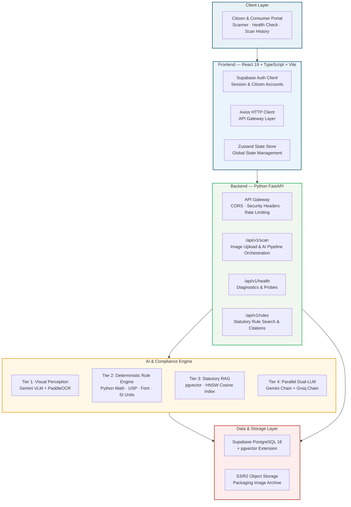
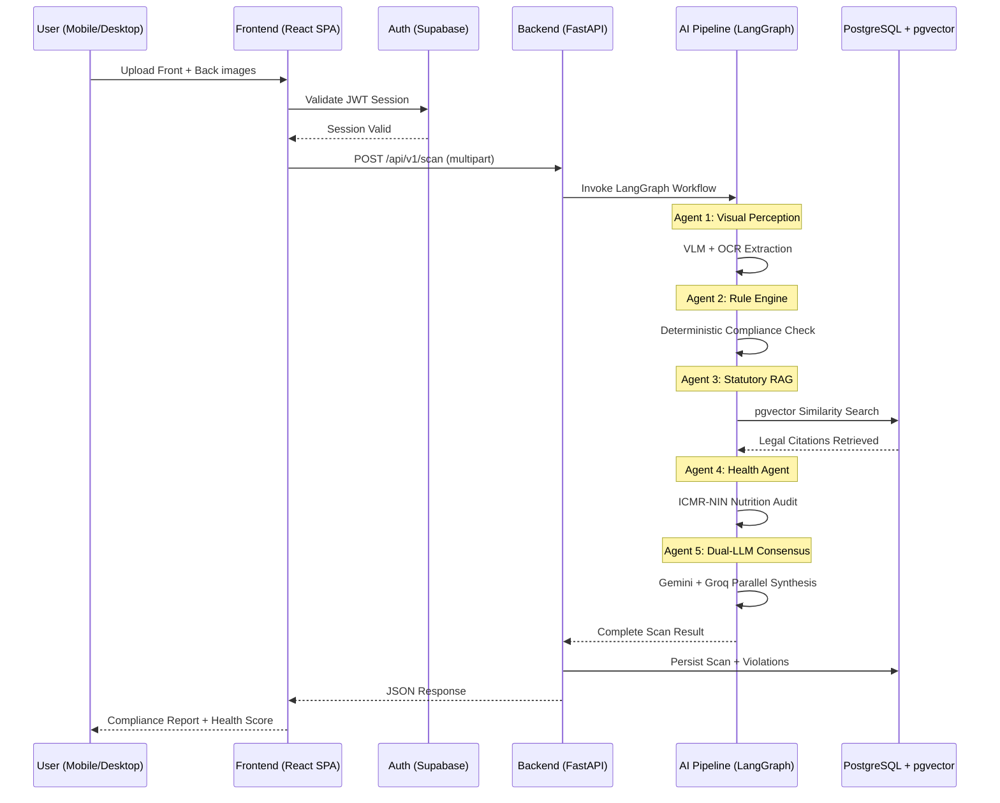
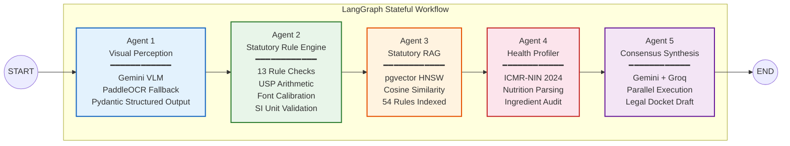
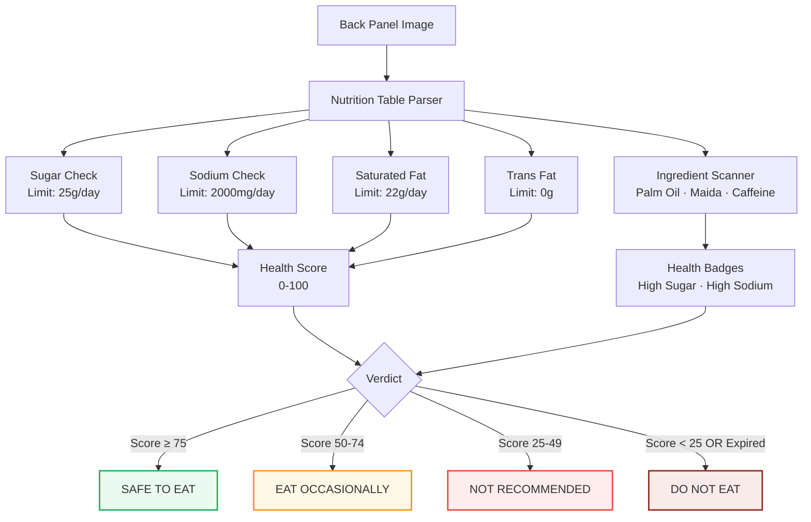
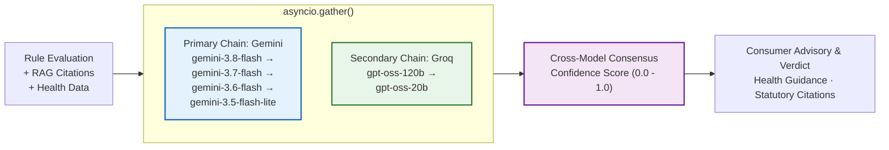
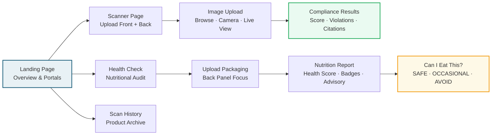

<div align="center">

# PackDrishti (PackDrashiti) — पैकदृष्टि

### AI-Powered Compliance Verification of Packaged Commodities under Legal Metrology Rules, 2011


**Statutory Framework**: Legal Metrology (Packaged Commodities) Rules, 2011  
**Administering Authority**: Department of Consumer Affairs — Legal Metrology Division, Ministry of Consumer Affairs, Food & Public Distribution, Government of India

[Live Demo (Frontend)](https://packdrashiti.vercel.app) · [API Endpoint](https://packdrashiti-backend.onrender.com/health) · [API Docs](https://packdrashiti-backend.onrender.com/api/v1/docs)

---

*Scan a product. Detect violations. Protect consumers. All in under 8 seconds.*

</div>

---

## Table of Contents

- [The Problem](#the-problem)
- [Our Solution](#our-solution)
- [Key Features](#key-features)
- [System Architecture](#system-architecture)
- [AI Pipeline — 5-Agent LangGraph Workflow](#ai-pipeline--5-agent-langgraph-workflow)
- [Statutory Rules Engine](#statutory-rules-engine)
- [Nutritional Health Engine (ICMR-NIN 2024)](#nutritional-health-engine-icmr-nin-2024)
- [Technology Stack](#technology-stack)
- [Application Screenshots & User Flows](#application-screenshots--user-flows)
- [Repository Structure](#repository-structure)
- [Getting Started](#getting-started)
- [API Reference](#api-reference)
- [Testing & Quality Assurance](#testing--quality-assurance)
- [Deployment](#deployment)
- [Team](#team)
- [References & Legal Authority](#references--legal-authority)

---

## The Problem

In India, **every retail pre-packaged commodity** is governed by the **Legal Metrology Act, 2009** and the **Legal Metrology (Packaged Commodities) Rules, 2011**. The law mandates **13+ mandatory declarations** on every package — manufacturer identity, net quantity in SI units, MRP inclusive of all taxes, Unit Sale Price, country of origin, consumer care details, and more.

### Current Reality

| Challenge | Impact |
|:---|:---|
| **Manual Inspections** | Over 500+ SKUs in typical retail stores — physically reading and checking every label is infeasible for everyday citizens |
| **Illegal Unit Abbreviations** | Packages print `gms`, `Kgs`, `ltrs` instead of legal `g`, `kg`, `l` — consumers rarely notice |
| **Price Manipulation** | Dual MRP stickers, missing Unit Sale Price, and hidden "inclusive of all taxes" clauses |
| **Font Size Violations** | Mandatory declarations printed in illegibly small fonts violating Rule 7 Table-I |
| **No Consumer Tool** | Zero automated tools exist for consumers to verify label compliance or nutritional safety |
| **Nutritional Deception** | Misleading "healthy" branding on products with dangerously high sugar, sodium, or trans fats |

> **Result**: Millions of non-compliant packages reach consumers daily, enabling unfair trade practices, health risks, and regulatory evasion worth an estimated **Rs 10,000+ crore annually**.

### Why PackDrashiti?

| Differentiator | What Makes It Unique |
|:---|:---|
| **5-Agent AI Pipeline** | Not a single-model system — a LangGraph multi-agent workflow with specialized agents for perception, rules, RAG, health, and consensus |
| **Zero Hallucination Rule Engine** | Statutory compliance checks use 100% deterministic Python math — no LLM guesswork for legal verdicts |
| **Dual-LLM Fault Tolerance** | Two independent LLM chains (Gemini + Groq) run in parallel; if one fails, the other delivers |
| **Statutory RAG with pgvector** | 878 codified legal rules indexed as vector embeddings — every citation is traceable to a gazette notification |
| **ICMR-NIN 2024 Health Engine** | First system to combine legal compliance with nutritional safety auditing against India's latest dietary standards |
| **< 8 Second End-to-End** | From image upload to full compliance report with statutory citations — faster than a human can read the label |
| **Consumer-First Architecture** | Dedicated platform empowering citizens to verify fair pricing, legal declarations, and nutritional safety |
| **PWA + Native Camera** | Works offline, installable as an app, direct hardware camera access — no app store needed |

---

## Our Solution

**PackDrashiti** is an AI-powered regulatory compliance verification and nutritional auditing platform. A user simply **photographs a product's front and back label** — the system automatically extracts all declarations, validates them against statutory rules, computes a compliance score, and generates enforceable inspection dockets.

```
                   ┌─────────────────┐
                   │   Scan Product   │
                   │  (Front + Back)  │
                   └────────┬────────┘
                            │
                   ┌────────▼────────┐
                   │  AI Perception  │  Multimodal VLM + PaddleOCR
                   │  Agent (Tier 1) │  Structured Data Extraction
                   └────────┬────────┘
                            │
              ┌─────────────┼─────────────┐
              │             │             │
     ┌────────▼──────┐ ┌───▼──────┐ ┌────▼────────┐
     │  Rule Engine   │ │ RAG Agent│ │   Health    │
     │  (Tier 2)      │ │ (Tier 3) │ │   Engine    │
     │  Deterministic │ │ pgvector │ │  ICMR-NIN   │
     └────────┬──────┘ └───┬──────┘ └────┬────────┘
              │             │             │
              └─────────────┼─────────────┘
                            │
                   ┌────────▼────────┐
                   │  Dual-LLM       │  Gemini + Groq Parallel
                   │  Consensus      │  Synthesis (Tier 4)
                   │  (Tier 4)       │
                   └────────┬────────┘
                            │
              ┌─────────────┼─────────────┐
              │                           │
     ┌────────▼──────────┐   ┌────────────▼───────────┐
     │  Consumer Report  │   │  FORM LM-INSP-2011     │
     │  Health Score     │   │  Statutory Notice PDF   │
     │  Dietary Advisory │   │  Violation Docket       │
     └───────────────────┘   └────────────────────────┘
```

### Dedicated to Everyday Consumers & Citizens

PackDrashiti puts regulatory compliance verification and nutritional safety tools directly into the hands of citizens:
- **Fair Pricing & Unit Sale Price**: Instantly catch inflated MRPs, missing taxes clauses, and unprinted unit prices.
- **Mandatory Packaging Declarations**: Verify manufacturer details, consumer care contacts, country of origin, and net quantity in legal SI units.
- **Expiry & Freshness Intelligence**: Automatic shelf-life calculation and expiry date validation relative to current time.
- **Nutritional Transparency**: Scientifically grounded ICMR-NIN 2024 health benchmarking with plain-language ingredient breakdowns.

---

## Key Features

### For Consumers & Citizens

- **Instant Label Compliance Scan** — Photograph front + back panels; get complete compliance results in <8 seconds
- **MRP & Unit Sale Price Verification** — Validates "inclusive of all taxes" clause and computes fair USP per gram/ml
- **Mandatory Statutory Declarations Audit** — Automatically checks Rule 6 mandatory declarations (Manufacturer details, Country of Origin, Customer Care contacts)
- **Expiry & Freshness Verification** — Detects manufacture/expiry dates and flags expired commodities or illegal offerings
- **Health Score (0-100)** — ICMR-NIN 2024 nutritional benchmarking with immediate bodily impact warnings
- **3-Tier Color Additive Grading** — Grade A (wholesome natural), Grade B (permitted synthetic), Grade C (high-concern azo dyes)
- **"Can I Eat This?" Verdict** — Clear, definitive SAFE / EAT OCCASIONALLY / NOT RECOMMENDED / DO NOT EAT banner
- **Ingredient Science Guide** — Plain-language explanations of what additives, preservatives, and seed oils do to your body
- **Searchable Scan History** — Persistent archive of all previously scanned packaging for personal reference and comparison
- **PWA + Mobile Camera** — Install directly as a native web app; direct hardware camera capture with autofocus and flash controls

---

## System Architecture

### High-Level Architecture


```mermaid
graph TB
    subgraph CLIENT["Client Layer"]
        CONSUMER["Citizen & Consumer Portal<br/>Scanner · Health Check · Scan History"]
    end

    subgraph FRONTEND["Frontend — React 19 + TypeScript + Vite"]
        direction LR
        SUPAAUTH["Supabase Auth Client<br/>Session & Citizen Accounts"]
        AXIOS["Axios HTTP Client<br/>API Gateway Layer"]
        ZUSTAND["Zustand State Store<br/>Global State Management"]
    end

    subgraph BACKEND["Backend — Python FastAPI"]
        direction LR
        GATEWAY["API Gateway<br/>CORS · Security Headers · Rate Limiting"]
        SCAN_EP["/api/v1/scan<br/>Image Upload & AI Pipeline Orchestration"]
        HEALTH_EP["/api/v1/health<br/>Diagnostics & Probes"]
        RULES_EP["/api/v1/rules<br/>Statutory Rule Search & Citations"]
    end

    subgraph AI["AI & Compliance Engine"]
        direction TB
        EXTRACTOR["Tier 1: Visual Perception<br/>Gemini VLM + PaddleOCR"]
        RULES["Tier 2: Deterministic Rule Engine<br/>Python Math · USP · Font · SI Units"]
        RAG["Tier 3: Statutory RAG<br/>pgvector · HNSW Cosine Index"]
        DUALLLM["Tier 4: Parallel Dual-LLM<br/>Gemini Chain + Groq Chain"]
    end

    subgraph DATA["Data & Storage Layer"]
        direction LR
        SUPABASE["Supabase PostgreSQL 16<br/>+ pgvector Extension"]
        R2["S3/R2 Object Storage<br/>Packaging Image Archive"]
    end

    CLIENT --> FRONTEND
    FRONTEND --> BACKEND
    BACKEND --> AI
    AI --> DATA
    BACKEND --> DATA

    style CLIENT fill:#E8F1F5,stroke:#1B5E7B,stroke-width:2px
    style FRONTEND fill:#EAF4FC,stroke:#1B5E7B,stroke-width:2px
    style BACKEND fill:#F0F7EE,stroke:#27AE60,stroke-width:2px
    style AI fill:#FFF8E7,stroke:#F39C12,stroke-width:2px
    style DATA fill:#FDEDEC,stroke:#C0392B,stroke-width:2px
```

### Request Lifecycle


```mermaid
sequenceDiagram
    participant U as User (Mobile/Desktop)
    participant F as Frontend (React SPA)
    participant A as Auth (Supabase)
    participant B as Backend (FastAPI)
    participant P as AI Pipeline (LangGraph)
    participant DB as PostgreSQL + pgvector

    U->>F: Upload Front + Back images
    F->>A: Validate JWT Session
    A-->>F: Session Valid
    F->>B: POST /api/v1/scan (multipart)
    B->>P: Invoke LangGraph Workflow
    
    Note over P: Agent 1: Visual Perception
    P->>P: VLM + OCR Extraction
    
    Note over P: Agent 2: Rule Engine
    P->>P: Deterministic Compliance Check
    
    Note over P: Agent 3: Statutory RAG
    P->>DB: pgvector Similarity Search
    DB-->>P: Legal Citations Retrieved
    
    Note over P: Agent 4: Health Agent
    P->>P: ICMR-NIN Nutrition Audit
    
    Note over P: Agent 5: Dual-LLM Consensus
    P->>P: Gemini + Groq Parallel Synthesis
    
    P-->>B: Complete Scan Result
    B->>DB: Persist Scan + Violations
    B-->>F: JSON Response
    F-->>U: Compliance Report + Health Score
```

---

## AI Pipeline — 5-Agent LangGraph Workflow

The core intelligence of PackDrashiti is a **stateful 5-agent LangGraph workflow** that processes packaging images through a sequential multi-agent pipeline. Each agent is a specialized node in the graph.

### Pipeline Architecture


```mermaid
graph LR
    START((START)) --> A1

    subgraph PIPELINE["LangGraph Stateful Workflow"]
        A1["Agent 1<br/>Visual Perception<br/>━━━━━━━━━━━━<br/>Gemini VLM<br/>PaddleOCR Fallback<br/>Pydantic Structured Output"]
        A2["Agent 2<br/>Statutory Rule Engine<br/>━━━━━━━━━━━━<br/>13 Rule Checks<br/>USP Arithmetic<br/>Font Calibration<br/>SI Unit Validation"]
        A3["Agent 3<br/>Statutory RAG<br/>━━━━━━━━━━━━<br/>pgvector HNSW<br/>Cosine Similarity<br/>54 Rules Indexed"]
        A4["Agent 4<br/>Health Profiler<br/>━━━━━━━━━━━━<br/>ICMR-NIN 2024<br/>Nutrition Parsing<br/>Ingredient Audit"]
        A5["Agent 5<br/>Consensus Synthesis<br/>━━━━━━━━━━━━<br/>Gemini + Groq<br/>Parallel Execution<br/>Legal Docket Draft"]
    end

    A1 --> A2 --> A3 --> A4 --> A5

    A5 --> END_NODE((END))

    style A1 fill:#E3F2FD,stroke:#1565C0,stroke-width:2px
    style A2 fill:#E8F5E9,stroke:#2E7D32,stroke-width:2px
    style A3 fill:#FFF3E0,stroke:#E65100,stroke-width:2px
    style A4 fill:#FCE4EC,stroke:#C62828,stroke-width:2px
    style A5 fill:#F3E5F5,stroke:#6A1B9A,stroke-width:2px
```

### Agent Details

#### Agent 1 — Visual Perception (Tier 1)

Multimodal VLM agent that directly inspects front and back packaging panel images. Uses **Google Gemini** for spatial perception with **PaddleOCR** as zero-manual-step fallback.

**Extracts**: Product name, brand, manufacturer address, net quantity, MRP, USP, manufacturing date, expiry date, FSSAI license, barcode, country of origin, consumer care info, nutritional table, ingredient list, PDP dimensions.

**Output**: Pydantic-validated `PackageVisualExtraction` schema with all 13+ mandatory declaration fields.

#### Agent 2 — Deterministic Rule Engine (Tier 2)

100% mathematically auditable Python logic for statutory compliance. **No AI hallucination possible** — every check is deterministic.

| Check | Rule | Logic |
|:---|:---|:---|
| Manufacturer/Packer Address | Rule 6(1)(a) | Regex: `(Manufactured\|Packed\|Marketed\|Imported)` + PIN `\b[1-9][0-9]{5}\b` |
| Country of Origin | Rule 6(1)(aa) | Match against ISO 3166-1 country list |
| Generic Commodity Name | Rule 6(1)(b) | Non-empty commodity descriptor verification |
| Net Quantity SI Units | Rule 6(1)(c) & Rule 13 | Strict whitelist: `g`, `kg`, `ml`, `l`. Flags: `gms`, `Kgs`, `ltrs`, `oz` |
| Date of Manufacture | Rule 6(1)(d) | Format validation: `MM/YYYY`, `MM/YY`, `Month Year` |
| MRP Declaration | Rule 6(1)(e) | "inclusive of all taxes" clause detection |
| Unit Sale Price (USP) | Rule 6(1)(e) 2nd Proviso | Mathematical computation: `MRP / net_quantity` in per g/ml or per kg/L |
| Consumer Care Contacts | Rule 6(1)(n) | 4 elements: contact person, address, phone, email |
| Font Height | Rule 7 Table-I | PDP area → minimum mm height step function (1.0 to 6.0 mm) |
| Color Contrast | Rule 9(1) | WCAG 2.1 relative luminance ratio ≥ 3.0:1 |
| Dual MRP Detection | Rule 18(2A) | Multiple price sticker / alteration detection |

**Rule 7 Table-I — Font Height Calibration**:

| PDP Area (cm²) | Minimum Height (mm) |
|:---|:---|
| ≤ 50 | 1.0 |
| 51–100 | 1.5 |
| 101–500 | 2.0 |
| 501–2500 | 4.0 |
| > 2500 | 6.0 |

#### Agent 3 — Statutory RAG (Tier 3)

Retrieval-Augmented Generation over the complete **Legal Metrology (Packaged Commodities) Rules, 2011** codified into a searchable vector database.

- **Vector Store**: Supabase PostgreSQL 16 with native `pgvector` extension
- **Index**: HNSW cosine similarity index over 54 rule embeddings
- **Dataset**: 878 statutory rule entries in `cleaned_rules_2011_2026.json` covering all chapters, amendments, and penalty provisions
- **Retrieval**: Semantic search matching detected violations to exact statutory clauses, penalty amounts, and compounding provisions

#### Agent 4 — Consumer Health Profiler (Tier 4a)

Nutritional safety audit engine benchmarked against **ICMR-NIN Recommended Dietary Allowances, 2024** and **WHO/FSSAI** thresholds.


```mermaid
graph TD
    IMG["Back Panel Image"] --> PARSE["Nutrition Table Parser"]
    PARSE --> SUGAR["Sugar Check<br/>Limit: 25g/day"]
    PARSE --> SODIUM["Sodium Check<br/>Limit: 2000mg/day"]
    PARSE --> SATFAT["Saturated Fat<br/>Limit: 22g/day"]
    PARSE --> TRANSFAT["Trans Fat<br/>Limit: 0g"]
    PARSE --> INGREDIENTS["Ingredient Scanner<br/>Palm Oil · Maida · Caffeine"]

    SUGAR --> SCORE["Health Score<br/>0-100"]
    SODIUM --> SCORE
    SATFAT --> SCORE
    TRANSFAT --> SCORE
    INGREDIENTS --> BADGES["Health Badges<br/>High Sugar · High Sodium"]

    SCORE --> VERDICT{"Verdict"}
    BADGES --> VERDICT

    VERDICT -->|Score ≥ 75| SAFE["SAFE TO EAT"]
    VERDICT -->|Score 50-74| MODERATE["EAT OCCASIONALLY"]
    VERDICT -->|Score 25-49| RISK["NOT RECOMMENDED"]
    VERDICT -->|Score < 25 OR Expired| DANGER["DO NOT EAT"]

    style SAFE fill:#EAFAF1,stroke:#27AE60,stroke-width:2px
    style MODERATE fill:#FEF9E7,stroke:#F39C12,stroke-width:2px
    style RISK fill:#FDEDEC,stroke:#E74C3C,stroke-width:2px
    style DANGER fill:#F9EBEA,stroke:#922B21,stroke-width:2px
```

**Checks performed**:
- Excess sugar, sodium, saturated fat, trans fat per 100g vs ICMR-NIN safe limits
- Artificial color additive grading (Grade A/B/C based on E-number classification)
- Ingredient hazard scanning (Palm Oil, Maida, Added Sugar, Caffeine, UPF markers)
- Immediate bodily reaction documentation (0-2 hours post-consumption)
- Chronic clinical risk mapping (NAFLD, atherosclerosis, hypertension, T2DM)

#### Agent 5 — Parallel Dual-LLM Consensus Synthesis (Tier 4b)

Final synthesis layer that fuses statutory findings, RAG citations, and health data into human-readable reports using **two independent LLM chains running concurrently**.


```mermaid
graph LR
    INPUT["Rule Evaluation<br/>+ RAG Citations<br/>+ Health Data"] --> PARALLEL

    subgraph PARALLEL["asyncio.gather()"]
        direction TB
        GEMINI["Primary Chain: Gemini<br/>gemini-3.8-flash →<br/>gemini-3.7-flash →<br/>gemini-3.6-flash →<br/>gemini-3.5-flash-lite"]
        GROQ["Secondary Chain: Groq<br/>gpt-oss-120b →<br/>gpt-oss-20b"]
    end

    PARALLEL --> CONSENSUS["Cross-Model Consensus<br/>Confidence Score (0.0 - 1.0)"]

    CONSENSUS --> CONSUMER_OUT["Consumer Advisory & Verdict<br/>Health Guidance · Statutory Citations"]

    style GEMINI fill:#E3F2FD,stroke:#1565C0,stroke-width:2px
    style GROQ fill:#E8F5E9,stroke:#2E7D32,stroke-width:2px
    style CONSENSUS fill:#F3E5F5,stroke:#6A1B9A,stroke-width:2px
```

- **Fault Tolerance**: Each chain has a fallback hierarchy — if `gemini-3.8-flash` is unavailable, it cascades to `3.7`, `3.6`, `3.5-lite`
- **Latency Optimization**: Both chains run concurrently via `asyncio.gather()`, so total latency = `max(gemini_time, groq_time)` rather than `sum()`
- **Cross-Validation**: Consensus confidence score reflects agreement between two independent model families

---

## Statutory Rules Engine

### Complete Compliance Verification Matrix

PackDrashiti validates against **13 statutory rules** from the Legal Metrology (Packaged Commodities) Rules, 2011:

```mermaid
mindmap
  root((Legal Metrology<br/>Rules 2011))
    Rule 6 — Mandatory Declarations
      6(1)(a) Manufacturer Address + PIN
      6(1)(aa) Country of Origin
      6(1)(b) Generic Commodity Name
      6(1)(c) Net Quantity (SI Units)
      6(1)(d) Date of Manufacture
      6(1)(e) MRP + Tax Clause
      6(1)(e) Unit Sale Price
      6(1)(n) Consumer Care Contacts
    Rule 7 — Font Height
      Table-I PDP Area Calibration
      1.0mm to 6.0mm Scale
    Rule 9 — Conspicuousness
      Color Contrast ≥ 3.0:1
      WCAG 2.1 Luminance Ratio
    Rule 13 — Standard Units
      SI Metric Only
      Prohibited: gms, Kgs, ltrs, oz
    Rule 18 — Price Integrity
      18(2A) Dual MRP Ban
      Sticker Alteration Detection
    Section 36(1) — Penalties
      First Offence: ₹25,000
      Second Offence: ₹50,000
      Subsequent: Imprisonment
```

### Violation Severity Classification

| Severity | Description | Examples | Penalty Range |
|:---|:---|:---|:---|
| **Critical** | Fundamental statutory omission | Missing MRP, missing manufacturer, no net quantity | ₹15,000 – ₹25,000 |
| **Major** | Non-standard declaration format | Illegal units (`gms`), missing USP, font too small | ₹5,000 – ₹15,000 |
| **Minor** | Incomplete but partially compliant | Address without PIN, date format ambiguous | ₹2,000 – ₹10,000 |

### USP (Unit Sale Price) Computation

The system performs **deterministic mathematical computation** of Unit Sale Price as mandated since October 2022:

```
If net_quantity ≤ 1 kg (or 1 L):
    USP = MRP / net_quantity_in_grams    → expressed as ₹X.XX per gram (or per ml)

If net_quantity > 1 kg (or 1 L):
    USP = MRP / net_quantity_in_kg       → expressed as ₹X.XX per kg (or per litre)
```

**Example**: A 250g biscuit packet with MRP ₹40 → USP = ₹40 / 250 = **₹0.16 per gram**

---

## Nutritional Health Engine (ICMR-NIN 2024)

### Benchmarks Used

| Nutrient | ICMR-NIN 2024 Safe Daily Limit | "High" Threshold (per 100g) |
|:---|:---|:---|
| Total Sugar | 25g free sugar/day | > 12.5g per 100g |
| Sodium | 2000mg/day | > 600mg per 100g |
| Saturated Fat | 22g/day (10% of 2000 kcal) | > 5g per 100g |
| Trans Fat | 0g (WHO elimination target) | > 0.5g per 100g |
| Total Fat | 67g/day | > 17.5g per 100g |

### 3-Tier Color Additive Grading

| Grade | Classification | Examples | Advisory |
|:---|:---|:---|:---|
| **Grade A** | Wholesome Natural | Curcumin (100), Beetroot Red (162), Paprika (160c), Chlorophyll (140) | Safe for all ages |
| **Grade B** | Permitted Synthetic | Caramel IV (150d), Brilliant Blue (133) | Within FSSAI limits |
| **Grade C** | High-Concern Azo Dyes | Tartrazine (102), Sunset Yellow (110), Allura Red (129), Titanium Dioxide (171) | EU hyperactivity warning; avoid for children |

### Health Score Algorithm

```
Health Score = 100 - Σ(penalty_per_excess_nutrient) - Σ(ingredient_hazard_penalty)

Penalties applied for:
  - Sugar exceeding ICMR limit:     -15 to -30 points
  - Sodium exceeding limit:         -10 to -25 points
  - Saturated fat exceeding limit:  -10 to -20 points
  - Trans fat detected (any):       -20 to -30 points
  - Palm oil / Maida detected:      -5 to -10 points
  - Grade C color additives:        -5 to -15 points
  - Product expired:                Score = 0 (DO NOT EAT)
```

---

## Technology Stack

### Frontend

| Technology | Version | Purpose |
|:---|:---|:---|
| **React** | 19.2.8 | Component UI framework with concurrent features |
| **TypeScript** | 6.0.2 | Static type safety across entire frontend |
| **Vite** | 8.2.2 | Build toolchain — sub-second HMR, optimized production bundles |
| **Tailwind CSS** | 3.4.19 | Utility-first styling with civic color palette |
| **Zustand** | 5.0.15 | Lightweight global state management |
| **Supabase JS** | 2.116.0 | Auth client — session persistence, JWT token injection |
| **Axios** | 1.20.0 | HTTP client for API communication |
| **Phosphor Icons** | 2.1.10 | Consistent iconography (zero emojis policy) |
| **Oxlint** | 1.79.0 | Blazing-fast linting (Rust-based) |

### Backend

| Technology | Version | Purpose |
|:---|:---|:---|
| **Python** | 3.11+ | Core runtime |
| **FastAPI** | 0.115+ | Async ASGI web framework with automatic OpenAPI docs |
| **Uvicorn** | 0.30+ | High-performance ASGI server |
| **Pydantic** | 2.8+ | Data validation, settings management, schema contracts |
| **SQLAlchemy** | 2.0+ | ORM with async PostgreSQL support |
| **Alembic** | 1.13+ | Database schema migrations |
| **Supabase** | 2.7+ | PostgreSQL + Auth + pgvector + Storage |
| **ReportLab** | 4.2+ | Statutory PDF generation (FORM LM-INSP-2011) |
| **python-jose** | 3.3+ | JWT token verification and RBAC |

### AI & ML

| Technology | Purpose |
|:---|:---|
| **LangGraph** | Stateful multi-agent workflow orchestration |
| **LangChain** | LLM integration framework |
| **Google Gemini** | Primary multimodal VLM (vision + language) |
| **Groq API** | Secondary LLM chain for parallel consensus |
| **PaddleOCR** | Zero-config local OCR fallback |
| **Supabase pgvector** | Vector similarity search for statutory RAG |

### Infrastructure

| Technology | Purpose |
|:---|:---|
| **Supabase** | PostgreSQL 16 database, Auth, pgvector, object storage |
| **Vercel** | Frontend deployment (React SPA) |
| **Render** | Backend deployment (FastAPI + AI pipeline) |

---

## Application Screenshots & User Flows

### User Journey (Citizen & Consumer Verification)


```mermaid
graph LR
    LAND["Landing Page<br/>Overview & Portals"] --> SCAN["Scanner Page<br/>Upload Front + Back"]
    LAND --> HEALTH["Health Check<br/>Nutritional Audit"]
    LAND --> HISTORY["Scan History<br/>Product Archive"]

    SCAN --> UPLOAD["Image Upload<br/>Browse · Camera · Live View"]
    UPLOAD --> RESULTS["Compliance Results<br/>Score · Violations · Citations"]

    HEALTH --> UPLOAD2["Upload Packaging<br/>Back Panel Focus"]
    UPLOAD2 --> NUTRI["Nutrition Report<br/>Health Score · Badges · Advisory"]
    NUTRI --> VERDICT["Can I Eat This?<br/>SAFE · OCCASIONAL · AVOID"]

    style LAND fill:#E8F1F5,stroke:#1B5E7B,stroke-width:2px
    style RESULTS fill:#EAFAF1,stroke:#27AE60,stroke-width:2px
    style VERDICT fill:#FEF9E7,stroke:#F39C12,stroke-width:2px
```

### Key Pages

| Page | Route | Description |
|:---|:---|:---|
| **Landing Page** | `/` | Platform entry, feature overview, dual portal launchers, PWA install prompt |
| **Label Compliance Scanner** | `/scanner` | Dual-panel image capture (Browse, Camera, Live View), real-time legal metrology compliance analysis |
| **Nutrition & Health Check** | `/health` | Back-panel nutrition audit, ICMR-NIN 2024 Health Score, dietary advisory, additive & colorant audit |
| **Scan History** | `/history` | Searchable archive of all past statutory and nutritional scans with filter and export options |

---

## Repository Structure

```
PackDrashiti/
├── frontend/                          # React 19 SPA (Deployed on Vercel)
│   ├── src/
│   │   ├── App.tsx                    # Root router with role-based navigation
│   │   ├── main.tsx                   # Entry point + Service Worker registration
│   │   ├── pages/
│   │   │   └── consumer/
│   │   │       ├── LandingPage.tsx    # Citizen portal & overview
│   │   │       ├── ScannerPage.tsx    # Dual-panel compliance scanner
│   │   │       ├── HealthCheckPage.tsx # Nutritional safety audit
│   │   │       └── ProductHistoryPage.tsx # Scan archive
│   │   ├── components/
│   │   │   ├── common/                # AuthModal, Button, Card, Modal, PWAInstallPrompt
│   │   │   ├── health/                # HealthBadgeGroup, NutrientRow, ArtificialColorsAudit,
│   │   │   │                          # WhatIsHighCard, DietaryAdvisory
│   │   │   ├── layout/                # Navbar, Footer
│   │   │   ├── reports/               # ViolationCard
│   │   │   └── scanner/               # AnnotatedImage, Camera
│   │   ├── data/                      # Statutory rules, ICMR benchmarks, mock datasets
│   │   ├── store/                     # Zustand global state stores
│   │   ├── types/                     # TypeScript domain interfaces
│   │   └── utils/                     # Compliance scoring, formatting utilities
│   ├── public/
│   │   ├── manifest.webmanifest       # PWA manifest (icons, shortcuts)
│   │   └── sw.js                      # Service Worker (cache-first + network-first)
│   ├── package.json
│   ├── tailwind.config.js             # Civic teal color palette
│   ├── vercel.json                    # Vercel SPA rewrite + security headers
│   └── vite.config.ts
│
├── backend/                           # Python FastAPI (Deployed on Render)
│   ├── src/
│   │   ├── main.py                    # FastAPI app factory + CORS + security middleware
│   │   ├── api/v1/
│   │   │   ├── router.py             # API v1 route aggregator
│   │   │   └── endpoints/
│   │   │       ├── health.py          # System diagnostics & probes
│   │   │       ├── scan.py            # Image upload & AI pipeline orchestration
│   │   │       └── rules.py           # Statutory rule search & citations
│   │   ├── core/
│   │   │   ├── config.py             # Pydantic settings (env vars, LLM chains)
│   │   │   ├── database.py           # SQLAlchemy async engine + session
│   │   │   ├── security.py           # JWT verification + RBAC middleware
│   │   │   └── cache.py              # In-memory async cache (cachetools)
│   │   ├── models/                    # SQLAlchemy 2.0 ORM models
│   │   │   ├── user.py, scan.py      # Users, scans, violations
│   │   │   ├── violation.py          # Statutory violation records
│   │   │   ├── health.py, report.py  # Health data, inspection reports
│   │   │   └── knowledge.py          # RAG knowledge base entries
│   │   └── services/
│   │       └── health_engine.py       # ICMR-NIN nutrition scoring
│   ├── tests/                         # Pytest automated test suite (33 tests)
│   │   ├── test_api.py               # REST API integration tests (5 tests)
│   │   ├── test_db.py                # Database model tests (5 tests)
│   │   ├── test_health.py            # Nutrition engine tests (4 tests)
│   │   ├── test_scan.py              # Scan pipeline tests (4 tests)
│   │   ├── test_scoring.py           # Compliance scoring tests (8 tests)
│   │   └── test_security.py          # Auth & RBAC tests (7 tests)
│   ├── alembic/                       # Database migrations
│   ├── requirements.txt
│   └── Dockerfile
│
├── ai/                                # AI & ML Pipeline
│   └── src/
│       ├── pipeline/
│       │   ├── langgraph_workflow.py  # 5-agent LangGraph state machine
│       │   ├── extractor.py           # VLM + OCR structured extraction
│       │   └── health_agent.py        # Multimodal health analysis agent
│       ├── llm/
│       │   └── dual_engine.py         # Parallel Gemini + Groq fallback engine
│       ├── rag/
│       │   └── supabase_vector.py     # pgvector semantic search module
│       └── rules/
│           ├── deterministic.py       # Deterministic compliance rule engine
│           └── nutrition_parser.py    # Nutritional table parser
│
├── dataset/                           # Legal Metrology Statutory Dataset
│   ├── cleaned_rules_2011_2026.json  # 878 codified rule entries
│   ├── cleaned_rules_2011_2026.csv   # Tabular statutory reference
│   ├── LEGAL_METROLOGY_RULES_2026.md # Digitized gazette codification
│   └── *.pdf                          # Original gazette documents
│
├── docs/                              # Detailed System Documentation (15 docs)
│   ├── prd_master_blueprint.md        # Master PRD & architecture
│   ├── api_specification.md           # Full OpenAPI contract
│   ├── database_schema.md            # PostgreSQL DDL & migrations
│   ├── rules_engine_spec.md          # Complete rules engine specification
│   ├── nutrition_profiling_spec.md   # ICMR-NIN health engine spec
│   ├── security_and_auth.md          # JWT RBAC & evidence chain
│   ├── design_system.md             # Visual design tokens & typography
│   └── ...                           # + 8 more specification documents
│
├── docker-compose.yml                # Local development stack
└── render.yaml                       # Render deployment configuration
```

---

## Getting Started

### Prerequisites

| Requirement | Minimum Version |
|:---|:---|
| Node.js | 18.0.0+ |
| npm | 9.0.0+ |
| Python | 3.11+ |
| pip | 23.0+ |

### 1. Clone the Repository

```bash
git clone https://github.com/z-lovejeet/PackDrishti.git
cd PackDrishti
```

### 2. Frontend Setup

```bash
cd frontend
npm install
npm run dev
```

The frontend will be accessible at `http://localhost:5173/`.

```bash
# Production build verification
npm run build

# Lint check
npm run lint
```

### 3. Backend Setup

```bash
# From project root directory:
# Create and activate virtual environment
python -m venv venv
source venv/bin/activate  # macOS/Linux (or .\venv\Scripts\activate on Windows)

# Install dependencies
pip install -r backend/requirements.txt

# Copy and configure environment variables
cp backend/.env.example backend/.env
# Configure backend/.env with your Supabase, Gemini, and Groq API keys

# Start the development server from root
python -m uvicorn backend.src.main:app --reload --port 8000
```

The backend API will be accessible at `http://localhost:8000/`.  
Interactive API docs at `http://localhost:8000/api/v1/docs`.

### 4. Docker Compose Quickstart (Full Stack)

Spin up PostgreSQL (with pgvector), FastAPI Backend, React Frontend (Nginx), and Adminer with one command:

```bash
docker compose up --build
```

| Service | Container | URL |
|:---|:---|:---|
| **Frontend (React + Nginx)** | `packdrashiti-frontend` | `http://localhost:3000` |
| **Backend API (FastAPI)** | `packdrashiti-backend` | `http://localhost:8000` |
| **Database GUI (Adminer)** | `packdrashiti-adminer` | `http://localhost:8080` |
| **PostgreSQL 16 + pgvector** | `packdrashiti-postgres` | `localhost:5432` |

### 5. Environment Variables

| Variable | Required | Description |
|:---|:---|:---|
| `SUPABASE_URL` | Yes | Supabase project URL |
| `SUPABASE_KEY` | Yes | Supabase anon public key |
| `SUPABASE_SERVICE_ROLE_KEY` | Yes | Supabase service role key (backend only) |
| `GEMINI_API_KEY` | Yes | Google Gemini API key for VLM + LLM |
| `GROQ_API_KEY` | Yes | Groq API key for secondary LLM chain |
| `JWT_SECRET_KEY` | Yes | 256-bit secret for JWT signing |
| `DATABASE_URL` | Yes | PostgreSQL connection string |
| `CORS_ORIGINS` | Yes | Allowed frontend origins |
| `APP_ENV` | No | `development` / `production` / `testing` |

---

## API Reference

### Base URL

| Environment | URL |
|:---|:---|
| Local Development | `http://localhost:8000/api/v1` |
| Production (Render) | `https://packdrashiti-backend.onrender.com/api/v1` |

### Endpoints

| Method | Endpoint | Description | Auth |
|:---|:---|:---|:---|
| `GET` | `/health` | System liveness & diagnostics probe | No |
| `POST` | `/api/v1/scan/upload` | Ingest packaging image with SHA-256 tamper-evident hash | Optional |
| `POST` | `/api/v1/scan/analyze` | Run 5-agent LangGraph workflow (front + back panels) | Optional |
| `GET` | `/api/v1/scan/:id` | Retrieve detailed statutory & health analysis by ID | Optional |
| `GET` | `/api/v1/scan/history` | Fetch personal scan and health audit history | Optional |
| `DELETE` | `/api/v1/scan/history` | Clear personal scan audit records | Optional |
| `GET` | `/api/v1/rules/search` | Statutory RAG semantic search across 2011 Metrology Rules | Optional |

### Scan Request Example

```bash
curl -X POST https://packdrashiti-backend.onrender.com/api/v1/scan \
  -H "Authorization: Bearer <JWT_TOKEN>" \
  -F "front_image=@front_panel.jpg" \
  -F "back_image=@back_panel.jpg"
```

### Scan Response Schema

```json
{
  "scan_id": "uuid",
  "compliance_score": 72.5,
  "is_compliant": false,
  "total_checks": 13,
  "passed_checks": 10,
  "failed_checks": 3,
  "violations": [
    {
      "rule_code": "PCR_RULE_6_1_C",
      "rule_name": "Net Quantity SI Units",
      "severity": "major",
      "description": "Non-standard unit 'gms' detected. Legal unit is 'g'.",
      "expected_value": "g or kg",
      "actual_value": "gms",
      "statutory_reference": "Rule 6(1)(c) read with Rule 13"
    }
  ],
  "health_analysis": {
    "health_score": 45,
    "verdict": "NOT RECOMMENDED",
    "high_nutrients": ["sugar", "sodium"],
    "badges": ["HIGH SUGAR", "HIGH SODIUM", "CONTAINS PALM OIL"]
  },
  "consensus_confidence": 0.87
}
```

---

## Testing & Quality Assurance

### Automated Test Suite

**33 tests** across 6 test modules covering all critical paths:

```
backend/tests/
├── test_api.py            5 tests   REST API integration (endpoints, uploads, routing)
├── test_db.py             5 tests   ORM models, database CRUD, relationship integrity
├── test_health.py         4 tests   Nutrition scoring, ICMR-NIN benchmarks, health verdicts
├── test_scan.py           4 tests   Scan pipeline, multipart image upload, rule search
├── test_scoring.py        8 tests   Compliance score computation, Rule 7 font calibration
└── test_security.py       7 tests   JWT auth, user roles, security headers
```

### Run Tests

```bash
cd backend
python -m pytest tests/ -v
```

**Latest Results**: 33/33 passed (100% passing test suite)

### Additional Quality Checks

| Check | Tool | Command |
|:---|:---|:---|
| Frontend Lint | Oxlint | `cd frontend && npm run lint` |
| Frontend Build | Vite + tsc | `cd frontend && npm run build` |
| Backend Syntax | compileall | `python -m compileall backend/src ai/src` |
| Zero-Emoji Policy | Custom CI | Enforced in CI — no emojis in source code or docs |

---

## Deployment

### Frontend — Vercel

The React SPA is deployed on **Vercel** with SPA rewrite rules and security headers.

| Setting | Value |
|:---|:---|
| Framework | Vite |
| Build Command | `npm run build` |
| Output Directory | `dist` |
| SPA Rewrite | `/(.*) → /index.html` |
| Security Headers | `X-Content-Type-Options`, `X-Frame-Options`, `X-XSS-Protection` |

### Backend — Render

The FastAPI application is deployed on **Render** (Singapore region) with health check probes.

| Setting | Value |
|:---|:---|
| Runtime | Python 3.11 |
| Build Command | `pip install -r backend/requirements.txt` |
| Start Command | `uvicorn backend.src.main:app --host 0.0.0.0 --port 8000` |
| Health Check | `GET /health` |
| Region | Singapore |

---

## Team

| Role | Responsibilities |
|:---|:---|
| **Frontend Developer** | React 19 SPA, Supabase Auth integration, canvas image processing, bounding box overlays, PWA implementation, responsive mobile UI |
| **Backend Developer** | FastAPI gateway, SQLAlchemy ORM, PostgreSQL schema design, JWT auth, statutory rules engine, REST API contracts |
| **Data Analyst / ML Engineer** | LangGraph workflow, VLM/OCR prompt engineering, deterministic Rule Engine, statutory RAG indexing, ICMR-NIN nutrition engine, dual-LLM consensus |
| **Tester + DevOps** | Pytest test suite (33 tests), CI/CD pipeline, Docker containerization, deployment on Render & Vercel |

---

## References & Legal Authority

### Primary Legislation

| Document | Authority |
|:---|:---|
| **The Legal Metrology Act, 2009** (Act No. 1 of 2010) | Parliament of India |
| **The Legal Metrology (Packaged Commodities) Rules, 2011** | Department of Consumer Affairs, MoCAF&PD |
| **G.S.R. 202(E), dated 7th March 2011** | Gazette of India Extraordinary |
| **Amendment 2021-2026** (USP, Country of Origin) | Gazette notifications |
| **Section 36(1)** — Penalty provisions | Legal Metrology Act, 2009 |
| **Section 48** — Compounding of offences | Legal Metrology Act, 2009 |
| **Jan Vishwas (Amendment of Provisions) Act, 2023** | 20% prompt settlement reduction |

### Nutritional Standards

| Standard | Authority |
|:---|:---|
| **ICMR-NIN Recommended Dietary Allowances, 2024** | Indian Council of Medical Research |
| **WHO Guideline: Sugars intake for adults and children, 2015** | World Health Organization |
| **FSSAI Food Safety & Standards (Labelling & Display) Regulations** | FSSAI, Government of India |

### Technology References

| Resource | URL |
|:---|:---|
| Google Gemini API | https://ai.google.dev/ |
| LangGraph Documentation | https://langchain-ai.github.io/langgraph/ |
| Supabase (PostgreSQL + pgvector) | https://supabase.com/ |
| WCAG 2.1 Contrast Guidelines | https://www.w3.org/WAI/WCAG21/Understanding/contrast-minimum |

---

<div align="center">

### PackDrishti (PackDrashiti) — पैकदृष्टि

*Empowering consumers and citizens with AI-driven packaging compliance verification.*

Department of Consumer Affairs — Legal Metrology Division  
Ministry of Consumer Affairs, Food & Public Distribution, Government of India

---

Built with React 19 · FastAPI · LangGraph · Google Gemini · Supabase · pgvector

Copyright 2026 Team PackDrishti. All rights reserved.

</div>

