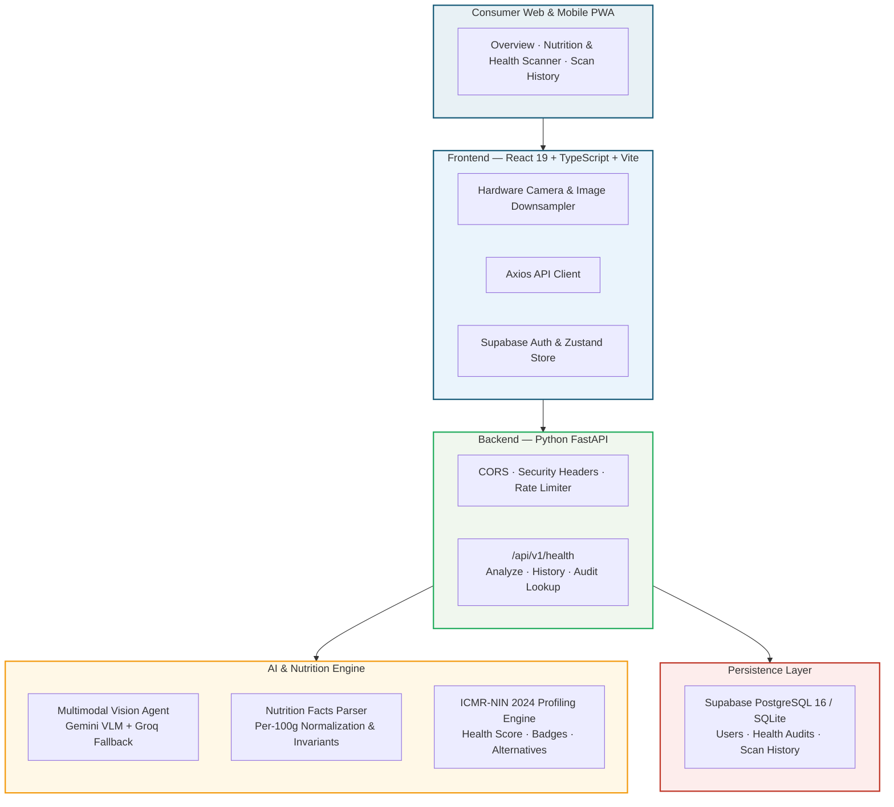
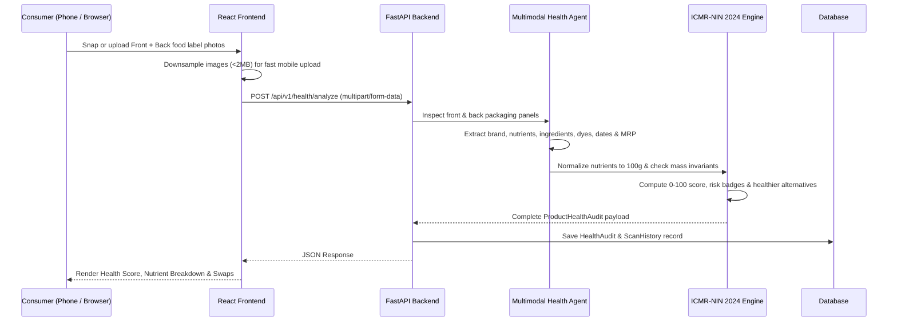

<div align="center">

# BiteIQ

### AI-Powered Consumer Food Nutrition, Ingredient Safety & Daily Product Scanner


**Dietary Benchmarks**: ICMR-NIN 2024 Dietary Guidelines for Indians · WHO Safe Intake Thresholds

[Live Demo (Frontend)](https://biteiq.vercel.app) · [API Endpoint](https://biteiq-backend.onrender.com/health) · [API Docs](https://biteiq-backend.onrender.com/api/v1/docs)

---

*Snap a food packet. Decode ingredients & nutrition. Choose healthier alternatives. All in under 8 seconds.*

</div>

---

## Table of Contents

- [The Problem](#the-problem)
- [Our Solution](#our-solution)
- [Key Consumer Features](#key-consumer-features)
- [System Architecture](#system-architecture)
- [AI & Nutrition Profiling Pipeline](#ai--nutrition-profiling-pipeline)
- [Nutritional Health Engine (ICMR-NIN 2024)](#nutritional-health-engine-icmr-nin-2024)
- [Technology Stack](#technology-stack)
- [User Journey & Views](#user-journey--views)
- [Repository Structure](#repository-structure)
- [Getting Started](#getting-started)
- [API Reference](#api-reference)
- [Testing & Quality Assurance](#testing--quality-assurance)
- [Deployment](#deployment)

---

## The Problem

Everyday shoppers face confusing, fine-print food labels when buying packaged snacks, biscuits, beverages, cereals, and groceries. Front-of-pack marketing often claims **"Baked"**, **"Multigrain"**, **"Energy Drink"**, or **"No Trans Fat"**, while the back panel hides high sugar, industrial palm oil, excessive sodium, and synthetic chemical dyes.

| Daily Shopping Challenge | Impact on Consumers & Families |
|:---|:---|
| **Tiny Serving-Size Tricks** | Brands declare nutrition per `15g` or `20g` serving so sugar and fat numbers look deceptively small |
| **Hidden Industrial Palm Oil** | Listed under aliases like *Edible Vegetable Oil (Palmolein)*, raising saturated fat intake |
| **Disguised Added Sugars** | Hidden behind names like *Liquid Glucose*, *Maltodextrin*, *Invert Sugar Syrup*, and *High Fructose Corn Syrup* |
| **Synthetic Azo Food Dyes** | Artificial colors like *Tartrazine (INS 102)*, *Sunset Yellow (INS 110)*, and *Allura Red (INS 129)* linked to hyperactivity in children |
| **Shelf-Life & Price Confusion** | Hard-to-spot expiry dates and odd pack weights (`68g`, `143g`) that make comparing real price per 100g difficult |

---

## Our Solution

**BiteIQ** is a daily-life consumer application that turns any smartphone or browser into an instant food scientist and nutritionist. Simply **photograph the front and back of any packaged food product** to receive an objective **0–100 Health Score**, per-100g nutrient normalization, ingredient & additive hazard alerts, expiry verification, unit price per 100g, and culturally familiar whole-food swaps.

```
                    ┌─────────────────────────┐
                    │   Snap Food Packaging    │
                    │  (Front + Back Panels)   │
                    └────────────┬────────────┘
                                 │
                    ┌────────────▼────────────┐
                    │  Multimodal VLM Agent   │  Google Gemini Vision + Groq Fallback
                    │  Visual Label Reading   │  Extracts Nutrition, Ingredients, Dates & MRP
                    └────────────┬────────────┘
                                 │
               ┌─────────────────┼─────────────────┐
               │                 │                 │
      ┌────────▼───────┐ ┌───────▼───────┐ ┌───────▼────────┐
      │ Per-100g Math  │ │ Ingredient &  │ │ Expiry & Price │
      │ Normalization  │ │ Additive Audit│ │ Value Engine   │
      │ Mass Invariants│ │ Palm Oil/Dyes │ │ Price per 100g │
      └────────┬───────┘ └───────┬───────┘ └───────┬────────┘
               │                 │                 │
               └─────────────────┼─────────────────┘
                                 │
                    ┌────────────▼────────────┐
                    │  ICMR-NIN 2024 Scorer   │  0–100 Health Score + Badges
                    │  & Clinical Advisory    │  Age Limits + Whole-Food Swaps
                    └─────────────────────────┘
```

---

## Key Consumer Features

- **0–100 Nutrition Health Score** — Scientifically calibrated against **ICMR-NIN 2024 Dietary Guidelines for Indians** and **WHO** thresholds.
- **Automatic Per-100g Normalization** — Converts misleading per-serving nutrition tables into a standardized `100g` / `100ml` baseline and verifies mass-conservation invariants (`Saturated Fat + Trans Fat <= Total Fat`, `Added Sugar <= Total Sugar`).
- **Palm Oil, Hidden Sugar & Additive Detection** — Flags palmolein, refined wheat flour (*maida*), MSG/flavour enhancers (`INS 621`, `627`, `631`), and ultra-processed NOVA Group 4 markers.
- **3-Tier Artificial Color Grading** — Classifies food dyes into **Grade A** (natural extracts), **Grade B** (permitted synthetic), and **Grade C** (high-risk azo dyes with pediatric warnings).
- **"Should You Eat This?" Verdict & Age Warnings** — Clear guidance on whether a product is safe for daily consumption, occasional indulgence, or should be avoided by toddlers, diabetics, or hypertensive individuals.
- **Expiry & Freshness Check** — Reads manufacturing and expiry dates and immediately alerts if a food product is past its safe shelf life (`Health Score = 0`).
- **Real Price per 100g & Value Check** — Calculates the normalized price per `100g`/`100ml` (`Budget`, `Fair Market Rate`, or `Premium`) so shoppers can compare value across pack sizes.
- **Culturally Aligned Whole-Food Alternatives** — Suggests practical Indian whole-food swaps (e.g., *Roasted Makhana*, *Whole Wheat Vermicelli*, *Tender Coconut Water*, *Buttermilk / Chaas*).
- **Personal Scan History** — Saves scanned products so consumers can search, filter, and compare past grocery items anytime.
- **Installable PWA + Mobile Camera** — Works on mobile and desktop browsers with direct camera capture.

---

## System Architecture


```mermaid
graph TB
    subgraph CLIENT["Consumer Web & Mobile PWA"]
        UI["Overview · Nutrition & Health Scanner · Scan History"]
    end

    subgraph FRONTEND["Frontend — React 19 + TypeScript + Vite"]
        direction LR
        CAMERA["Hardware Camera & Image Downsampler"]
        AXIOS["Axios API Client"]
        AUTH["Supabase Auth & Zustand Store"]
    end

    subgraph BACKEND["Backend — Python FastAPI"]
        direction LR
        GATEWAY["CORS · Security Headers · Rate Limiter"]
        HEALTH_EP["/api/v1/health<br/>Analyze · History · Audit Lookup"]
    end

    subgraph AI["AI & Nutrition Engine"]
        direction TB
        VLM["Multimodal Vision Agent<br/>Gemini VLM + Groq Fallback"]
        PARSER["Nutrition Facts Parser<br/>Per-100g Normalization & Invariants"]
        SCORER["ICMR-NIN 2024 Profiling Engine<br/>Health Score · Badges · Alternatives"]
    end

    subgraph DATA["Persistence Layer"]
        DB["Supabase PostgreSQL 16 / SQLite<br/>Users · Health Audits · Scan History"]
    end

    CLIENT --> FRONTEND
    FRONTEND --> BACKEND
    BACKEND --> AI
    BACKEND --> DATA

    style CLIENT fill:#E8F1F5,stroke:#1B5E7B,stroke-width:2px
    style FRONTEND fill:#EAF4FC,stroke:#1B5E7B,stroke-width:2px
    style BACKEND fill:#F0F7EE,stroke:#27AE60,stroke-width:2px
    style AI fill:#FFF8E7,stroke:#F39C12,stroke-width:2px
    style DATA fill:#FDEDEC,stroke:#C0392B,stroke-width:2px
```

---

## AI & Nutrition Profiling Pipeline


```mermaid
sequenceDiagram
    participant U as Consumer (Phone / Browser)
    participant F as React Frontend
    participant B as FastAPI Backend
    participant A as Multimodal Health Agent
    participant E as ICMR-NIN 2024 Engine
    participant DB as Database

    U->>F: Snap or upload Front + Back food label photos
    F->>F: Downsample images (<2MB) for fast mobile upload
    F->>B: POST /api/v1/health/analyze (multipart/form-data)
    B->>A: Inspect front & back packaging panels
    A->>A: Extract brand, nutrients, ingredients, dyes, dates & MRP
    A->>E: Normalize nutrients to 100g & check mass invariants
    E->>E: Compute 0-100 score, risk badges & healthier alternatives
    E-->>B: Complete ProductHealthAudit payload
    B->>DB: Save HealthAudit & ScanHistory record
    B-->>F: JSON Response
    F-->>U: Render Health Score, Nutrient Breakdown & Swaps
```

---

## Nutritional Health Engine (ICMR-NIN 2024)

### Daily Benchmarks & High-Risk Thresholds

| Nutrient | ICMR-NIN 2024 Safe Daily Limit | High Threshold (Solid per 100g) | High Threshold (Liquid per 100ml) |
|:---|:---|:---|:---|
| **Added Sugars** | 25g free sugar / day | > 10.0g | > 5.0g |
| **Sodium** | 2000mg / day | > 600mg | > 300mg |
| **Saturated Fat** | 20g / day | > 4.0g | > 2.0g |
| **Trans Fat** | 0g (WHO elimination target) | > 0.0g (any trace penalized) | > 0.0g |
| **Total Fat** | 67g / day | > 17.5g | > 8.75g |

### 3-Tier Artificial Color Additive Grading

| Grade | Classification | Examples | Consumer Advisory |
|:---|:---|:---|:---|
| **Grade A** | Wholesome Natural | Curcumin (INS 100), Annatto (INS 160b), Beetroot Red (INS 162), Paprika (INS 160c) | Safe for all age groups |
| **Grade B** | Permitted Synthetic | Caramel (INS 150d), Brilliant Blue (INS 133), Erythrosine (INS 127) | Consume in moderation |
| **Grade C** | High-Risk Azo Dyes | Tartrazine (INS 102), Sunset Yellow (INS 110), Carmoisine (INS 122), Allura Red (INS 129) | Avoid or strictly limit for children |

### Health Score Formula (0–100)

```text
Health Score = clamp(0, 100, round(100 - Total Penalties + Total Positive Credits))

Deductions:
  - Added Sugars above threshold:   up to -35 points
  - Sodium above threshold:         up to -25 points
  - Saturated Fat above threshold:  up to -20 points
  - Any Trans Fat (> 0.0g):         immediate -30 points flat penalty
  - NOVA Group 4 Ultra-Processed:   -10 points
  - Expired Product:                Score = 0 (CRITICAL HAZARD - DO NOT CONSUME)

Positive Credits (applied when not ultra-processed):
  - Dietary Fiber (>= 3.0g/100g):   up to +10 points
  - Protein (>= 5.0g/100g):         up to +10 points
```

---

## Technology Stack

### Frontend
- **React 19 + TypeScript 6 + Vite 8** — Fast, type-safe single-page application
- **Tailwind CSS** — Responsive consumer UI with clean typography (`Plus Jakarta Sans` & `JetBrains Mono`)
- **Zustand + Supabase Auth** — Lightweight consumer session management
- **Phosphor Icons** — Crisp vector iconography

### Backend & AI
- **Python 3.11+ & FastAPI** — Async REST API with security headers, rate limiting, and OpenAPI docs
- **Google Gemini Multimodal VLM & Groq Fallback** — Direct visual extraction of packaging panels
- **ICMR-NIN 2024 Deterministic Scoring Engine** — Auditable Python nutrition math and invariant checks
- **SQLAlchemy 2.0 + Supabase PostgreSQL / SQLite** — Async persistence for `User`, `HealthAudit`, and `ScanHistory`

---

## User Journey & Views

| Page | Route | Description |
|:---|:---|:---|
| **Overview** | `/#landing` | Consumer home page highlighting what BiteIQ checks on every food packet |
| **Nutrition & Health Scanner** | `/#health` | Dual-panel image uploader & camera scanner delivering 0–100 health scores, nutrient bars, additive/color audits, expiry alerts, price per 100g, and healthier swaps |
| **Scan History** | `/#history` | Personal food log to search, filter (`Nutritious 70+` vs `Caution / Concern`), and manage past scans |

---

## Repository Structure

```text
BiteIQ/
├── frontend/                          # React 19 Consumer Web App (Vercel)
│   ├── src/
│   │   ├── App.tsx                    # Consumer router (landing, health, history)
│   │   ├── main.tsx                   # Application entry point & PWA registration
│   │   ├── pages/consumer/
│   │   │   ├── LandingPage.tsx        # Consumer overview & shopping guide
│   │   │   ├── HealthCheckPage.tsx    # Multimodal food & nutrition scanner
│   │   │   └── ProductHistoryPage.tsx # Personal food scan history
│   │   ├── components/
│   │   │   ├── common/                # Button, Badge, Card, Modal, Toast, AuthModal
│   │   │   ├── health/                # HealthBadgeGroup, NutrientRow, ArtificialColorsAudit,
│   │   │   │                          # WhatIsHighCard, DietaryAdvisory
│   │   │   ├── layout/                # Navbar, Footer
│   │   │   └── scanner/               # Camera hardware capture modal
│   │   ├── store/                     # Zustand auth store
│   │   ├── types/                     # TypeScript interfaces
│   │   └── utils/                     # API client, image downsampling, formatters
│   ├── public/                        # PWA manifest, icons, service worker
│   └── package.json
│
├── backend/                           # Python FastAPI Backend (Render)
│   ├── src/
│   │   ├── main.py                    # FastAPI app, CORS, security headers
│   │   ├── api/v1/
│   │   │   ├── router.py              # API v1 router (/api/v1/health)
│   │   │   └── endpoints/
│   │   │       └── health.py          # Analyze, history, and audit endpoints
│   │   ├── core/                      # Config, async DB session, JWT security, cache
│   │   ├── models/                    # User, HealthAudit, ScanHistory ORM models
│   │   └── services/
│   │       └── health_engine.py       # ICMR-NIN 2024 nutrition profiling engine
│   ├── tests/                         # Pytest test suite (26 automated tests)
│   ├── alembic/                       # Database migrations
│   └── requirements.txt
│
├── ai/                                # Multimodal Vision & Nutrition Rules
│   └── src/
│       ├── pipeline/
│       │   └── health_agent.py        # Multimodal food label & ingredient analyzer
│       └── rules/
│           └── nutrition_parser.py    # Per-100g normalization & mass invariants
│
├── docker-compose.yml                 # Local multi-container stack
├── Dockerfile                         # Production backend container image
└── render.yaml                        # Render cloud deployment blueprint
```

---

## Getting Started

### 1. Clone the Repository

```bash
git clone https://github.com/z-lovejeet/PackDrishti.git biteiq
cd biteiq
```

### 2. Run the Frontend

```bash
cd frontend
npm install
npm run dev
```

The web app will be available at `http://localhost:5173`.

### 3. Run the Backend

```bash
# From the repository root:
python -m venv venv
source venv/bin/activate

pip install -r backend/requirements.txt

# Start the FastAPI server
python -m uvicorn backend.src.main:app --reload --port 8000
```

The API will be available at `http://localhost:8000` (Swagger UI at `http://localhost:8000/api/v1/docs`).

---

## API Reference

| Method | Endpoint | Description |
|:---|:---|:---|
| `GET` | `/health` | Root liveness probe |
| `GET` | `/api/v1/health` | Subsystem readiness diagnostics |
| `POST` | `/api/v1/health/analyze` | Analyze front & back food packaging images for nutrition, ingredients, expiry & price value |
| `GET` | `/api/v1/health/history` | List saved consumer food scans |
| `DELETE` | `/api/v1/health/history` | Clear all saved consumer food scans |
| `GET` | `/api/v1/health/{audit_id}` | Retrieve a specific nutrition & health audit by UUID |
| `DELETE` | `/api/v1/health/{audit_id}` | Delete a specific scan record by UUID |

### Example Request

```bash
curl -X POST http://localhost:8000/api/v1/health/analyze \
  -F "front_image=@front_label.jpg" \
  -F "back_image=@back_nutrition.jpg"
```

---

## Testing & Quality Assurance

Run the complete backend and frontend verification suites from the project root:

```bash
# Run all 26 backend unit & integration tests
python -m pytest backend/tests/ -v

# Run frontend linter and production build
npm --prefix frontend run lint
npm --prefix frontend run build
```

---

## Deployment

- **Frontend (Vercel)**: Import the repository on Vercel with Root Directory set to `frontend` and `VITE_API_URL` pointing to your Render backend URL.
- **Backend (Render)**: Deploy using the root `Dockerfile` or `render.yaml` with `GEMINI_API_KEY`, `GROQ_API_KEY`, `DATABASE_URL`, and `CORS_ORIGINS` configured in environment variables.
